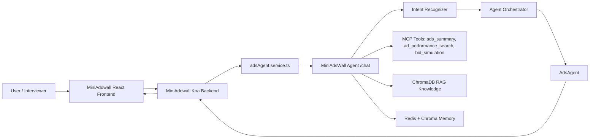

# 业务背景
本项目聚集真实广告系统的Ads投放链路最小闭环：“广告主创建 Campaign（广告活动）→ 平台管理 Ad Group（广告组）与 Creative（广告素材）→ 用户产生 Impression（曝光）、Click（点击）和 Conversion（转化）→ 系统回收 CTR、CVR、CPA、ROI 等效果数据并进行数据反馈”。  
传统广告墙通常只完成广告管理与数据展示：广告主看到 CTR 下降、CPA 上升或预算消耗异常后，仍需人工判断问题来自素材疲劳、受众定向、Bid（出价）、Budget（预算）还是落地页转化；再在多个页面和指标之间反复分析、调整。  
MiniAdsWall Agent 在这条最小完整业务链路上，引入广告领域 Agent，将投放数据、广告知识库和运营工具连接起来，帮助运营人员完成 Campaign 表现查询、异常归因、Creative 优化、Budget 分配、Bid 策略模拟等工作，把“看报表”升级为“得到可执行的投放建议”。

# 技术背景


MiniAddwall + MiniAdsWall Agent 是一个一个基于 React/Koa 的全栈广告管理系统，连接至 FastAPI 多智能体 AI 后端。
前端为MiniAddwall，保留了广告增删改查、视频上传、点击追踪、排序、仪表盘以及创意生成功能。而MiniAdsWall Agent增加了代理层，包含广告代理路由、结构化广告分析工具、RAG知识检索、记忆、技能、监控与评估功能。

## Repository Layout

```text
.
├── apps/
│   └── mini-ad-wall/              # React + Koa advertising product
│       ├── client/                # MiniAddwall frontend
│       └── server/                # MiniAddwall Koa backend
├── agents/                        # MiniAdsWall Agent agent orchestration
├── api/                           # MiniAdsWall Agent FastAPI app
├── core/                          # Intent recognizer and Skill loader
├── mcp/                           # Knowledge and ad tools
├── memory/                        # Conversation memory
├── monitor/                       # Runtime monitoring
├── skills/                        # Hot-loadable business rules
├── evaluation/                    # Eval harness
├── docs/                          # Architecture and demo notes
├── docker-compose.yml             # MiniAdsWall Agent services
└── requirements.txt
```

## High-Level Architecture



## Interviewer Reading Guide

- `apps/mini-ad-wall/server/services/adsAgent.service.ts` sends structured `ads` data to MiniAdsWall Agent instead of only a prompt summary.
- `api/main.py` accepts `ads`, calls ad tools, injects tool/RAG context, and returns `tools_used`.
- `mcp/ads_tools.py` implements `ads_summary`, `ad_performance_search`, and `bid_simulation`.
- `agents/agent_orchestrator.py` routes `ad_optimization`, `creative_generation`, and `bid_strategy` to `AdsAgent`.
- `core/intent_recognizer.py` contains multi-strategy intent recognition with ad-specific categories.
- `mcp/knowledge_base.py` contains ChromaDB-backed RAG with default advertising operations documents.
- `skills/ads_optimization/SKILL.md` contains hot-loadable business rules for AdsAgent behavior.
