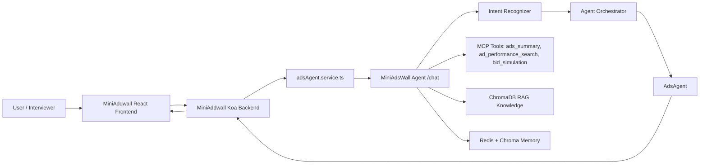

# MiniAdsWall

MiniAddwall + MiniAdsWall Agent is a full-stack advertising operations demo: a React/Koa ad management system connected to a FastAPI multi-agent AI backend.

The frontend is MiniAddwall. It keeps the original ad CRUD, video upload, click tracking, ranking, dashboard, and creative-generation features. MiniAdsWall Agent adds the agent layer: AdsAgent routing, structured ad-analysis tools, RAG knowledge retrieval, memory, Skills, monitoring, and evaluation.

## What This Shows

- Full-stack product flow: React + Vite frontend, Koa API backend, FastAPI AI service.
- Domain Agent design: ad optimization, creative generation, and bid strategy route to `AdsAgent`.
- Tool-augmented reasoning: MiniAdsWall Agent calls `ads_summary`, `ad_performance_search`, and `bid_simulation`.
- RAG: ChromaDB-backed ad knowledge for ranking, CTR, creative testing, budget and risk boundaries.
- Memory and observability: Redis/Chroma memory, Prometheus metrics, evaluator hooks.
- Graceful integration: MiniAddwall falls back to local diagnosis if MiniAdsWall Agent is unavailable.

## Repository Layout

```text
.
├── apps/
│   └── mini-ad-wall/              # React + Koa advertising product
│       ├── client/                # MiniAddwall frontend
│       └── server/                # MiniAddwall Koa backend
├── agents/                        # MiniAdsWall Agent agent orchestration
├── api/                           # MiniAdsWall Agent FastAPI app
├── core/                          # Intent recognizer and Skill loader
├── mcp/                           # Knowledge and ad tools
├── memory/                        # Conversation memory
├── monitor/                       # Runtime monitoring
├── skills/                        # Hot-loadable business rules
├── evaluation/                    # Eval harness
├── docs/                          # Architecture and demo notes
├── docker-compose.yml             # MiniAdsWall Agent services
└── requirements.txt
```

## High-Level Architecture



## Quick Start

### 1. Start MiniAdsWall Agent

```bash
cp .env.example .env
```

Fill at least:

```env
ANTHROPIC_API_KEY=your_key_here
API_PORT=8000
CHROMA_HOST=localhost
CHROMA_PORT=8001
ECHOMIND_SKILLS_DIR=./skills
```

`ECHOMIND_SKILLS_DIR` is kept as a backwards-compatible environment variable name for the Skill loader.

Start MiniAdsWall Agent and its dependencies:

```bash
docker compose up --build
```

Check:

```bash
curl http://localhost:8000/health
```

### 2. Start MiniAddwall Server

```bash
cd apps/mini-ad-wall/server
npm install
ADS_AGENT_API_URL=http://localhost:8000 npm run dev
```

Optional, only for MiniAddwall's standalone creative/strategy generation endpoints:

```bash
OPENROUTER_API_KEY=your_openrouter_key ADS_AGENT_API_URL=http://localhost:8000 npm run dev
```

### 3. Start MiniAddwall Frontend

```bash
cd apps/mini-ad-wall/client
npm install
npm run dev
```

Open the Vite URL, usually:

```text
http://localhost:5173
```

Click the bottom-right AI button. If MiniAdsWall Agent is running, the assistant status shows `MiniAdsWall Agent 已连接`.

## Interviewer Reading Guide

- `apps/mini-ad-wall/server/services/adsAgent.service.ts` sends structured `ads` data to MiniAdsWall Agent instead of only a prompt summary.
- `api/main.py` accepts `ads`, calls ad tools, injects tool/RAG context, and returns `tools_used`.
- `mcp/ads_tools.py` implements `ads_summary`, `ad_performance_search`, and `bid_simulation`.
- `agents/agent_orchestrator.py` routes `ad_optimization`, `creative_generation`, and `bid_strategy` to `AdsAgent`.
- `core/intent_recognizer.py` contains multi-strategy intent recognition with ad-specific categories.
- `mcp/knowledge_base.py` contains ChromaDB-backed RAG with default advertising operations documents.
- `skills/ads_optimization/SKILL.md` contains hot-loadable business rules for AdsAgent behavior.

## Demo Questions

Try these in the MiniAddwall AI assistant:

```text
分析当前广告表现，给出三个优化动作
```

```text
哪些广告应该提高出价，哪些应该先改素材？
```

```text
帮我生成下一轮 A/B 测试计划
```

More detail: see [docs/architecture.md](docs/architecture.md), [docs/api-flow.md](docs/api-flow.md), and [docs/demo-script.md](docs/demo-script.md).

## Notes

- Do not commit real `.env` files or API keys.
- Local ChromaDB and Redis data are intentionally ignored.
- `apps/mini-ad-wall/server/uploads/` is kept with a `.gitkeep`; uploaded/demo videos are local runtime assets and are not committed.
