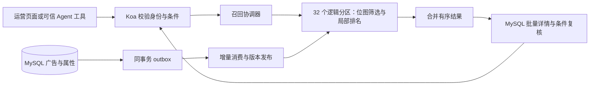

# MiniAdsWall 多属性广告召回 SDD

- 版本：0.1
- 日期：2026-10-10
- 状态：设计完成；代码、迁移与容量验收尚未完成。
- 目标：在百万至千万条广告上执行多属性 `IN / NOT IN` 筛选，并有界地返回排名靠前的广告。
- 技术路线：MySQL 保存业务事实；倒排索引以 Roaring Bitmap 保存广告 ID 集合；独立召回服务执行集合运算和 Top-K。

## 1. 范围与文档关系

本文覆盖属性模型、布尔条件语义、整数 ID、位图索引、排序、事务事件、重建、接口、现有调用迁移和验收。它细化 [营销系统 SDD](整体业务向优化SDD.md) 的受众条件过滤，并衔接 [后端可靠性 SDD](backend-reliability-sdd.md) 的 G02 广告上下文与分页修复。

首版支持已登记的字符串枚举属性、单值/多值属性、AND、IN、NOT IN、存在性判断。数值区间、嵌套任意布尔表达式、文本搜索、向量搜索、用户画像匹配、预算扣减、频控和真实竞价另有设计，不由位图自动提供。本文筛选的是广告自身属性；广告投放规则与用户画像的匹配不能直接套用本接口。

当前只有运营凭据，没有完整广告租户归属模型。首版使用现有单广告池，接口仅对认证运营和可信内部服务开放；不能凭客户端传来的 brand_id/workspace_id 宣称完成资源隔离。开放多品牌前须落实归属表与服务端授权集合。

本文的参数与性能数值是实施默认值和验收目标，不是现有成绩。当前一万广告的营销演示范围仍按原 SDD 验收；本设计通过千万广告测试后，才能扩大该容量结论。

## 2. 源码基线与缺口

基线为当前工作区，包括尚未提交的 MySQL 改造，不等于已部署状态。

| 位置 | 当前行为 | 所需变化 |
| --- | --- | --- |
| [ads.model.ts](../apps/mini-ad-wall/server/models/ads.model.ts) 的 getAllAds | 无 WHERE/LIMIT，按 ranking_score 读全部广告 | 新增有界 ID 查询；新链路禁用全量读取 |
| [001_ads.sql](../apps/mini-ad-wall/server/migrations/001_ads.sql) | UUID 主键、排名索引；无定向属性 | 增量增加属性、整数映射和索引事件 |
| [ads.service.ts](../apps/mini-ad-wall/server/services/ads.service.ts) | 字段白名单不接受 attributes | 增加登记属性校验；保留幂等和版本控制 |
| [ads.controller.ts](../apps/mini-ad-wall/server/controllers/ads.controller.ts) | GET /api/ads 返回整个数组 | 新增筛选接口与分页列表，迁移页面 |
| [agent.routes.ts](../apps/mini-ad-wall/server/routes/agent.routes.ts) | 创建 run 时注入全部广告 | 改为服务端生成有限 ad_context |
| [ai.controller.ts](../apps/mini-ad-wall/server/controllers/ai.controller.ts) | 同步助手读取全部广告 | 复用同一个有界上下文服务 |
| [hosting/api.py](../hosting/api.py) | RunInput.ads 上限 1,000 条 | 新增 ad_context，保留历史输入兼容 |
| [hosting/pipeline.py](../hosting/pipeline.py)、[ads_tools.py](../mcp/ads_tools.py) | 对输入广告数组统计、检索、模拟 | 分开完整统计与有限明细，明确样本范围 |

现有 MySQL 事务、操作幂等、审计、更新 version 与点击原子递增继续保留。RAG 文档召回不承担广告属性过滤。

## 3. 必须成立的约束

| 编号 | 约束 |
| --- | --- |
| R01 | 返回的广告符合登记的属性语义，且在详情复核时仍启用、未删除、位于投放时间内 |
| R02 | MySQL 是业务事实来源；索引故障不能让广告写入只成功在内存里 |
| R03 | 广告、属性、操作结果、审计与索引事件同事务提交或回滚 |
| R04 | 已分配的整数 doc_id 永不复用；删除与重建不能让旧事件恢复广告 |
| R05 | 索引事件可重复消费；不越过缺失事件；旧消费进程不能覆盖新检查点 |
| R06 | 否定条件只从有效广告集合中扣除，不能对无限整数空间取反 |
| R07 | 查询有条件数、时间、内存、枚举量和详情条数上限；超限明确失败 |
| R08 | 不用截断候选冒充完整召回，不用有限明细冒充全量统计 |
| R09 | 位图、属性正向数据与排序结构作为同一个索引版本发布 |
| R10 | 索引最终一致；返回详情复核防止错误返回，但无法补回尚未入索引的新广告 |

## 4. 属性与查询语义

### 4.1 属性登记与规范化

属性定义包括 field_id、field_key、cardinality（scalar/multi）、最大值数和启用状态。首版属性键为 ASCII 小写字母、数字、下划线，长度 1–64；值为非空字符串，Unicode NFC 规范化后最多 256 UTF-8 字节，大小写敏感，不自动去空格。写入与查询使用同一规范化函数。

广告输入示例：

```json
{
  "attributes": {
    "region": ["上海"],
    "category": ["数码"],
    "tags": ["d", "e"]
  },
  "eligibility": {
    "enabled": true,
    "starts_at": "2026-10-10T00:00:00Z",
    "ends_at": "2026-11-10T00:00:00Z"
  }
}
```

scalar 最多一个值；multi 去重后最多 50 个值。单广告最多 128 个属性、512 个属性值，attributes JSON 最多 64 KiB。超限返回 400，不截断。缺失键与空数组都表示该属性不存在，不写空值索引；null 不接受。未知属性返回 400，已登记属性下未知查询值视为无广告命中。

starts_at/ends_at 保存为 UTC DATETIME(3)，输入必须含时区，null 表示无该方向时间限制；同时存在时须 starts_at < ends_at。更新 attributes 使用整组替换语义，未提交该字段则保留原值，空对象表示清空全部属性；eligibility 未提交的子字段保留原值。新增广告 enabled 默认 false。字段和时间校验失败不进入业务事务。

属性定义首版由版本化迁移/配置登记，不开放运行时改名、改 cardinality。定义变更须生成 schema_version 并重建，禁止旧索引执行新语义。

### 4.2 条件合约

所有条件以 AND 连接。一个 IN 条件中的值是 OR；多值属性只要有任意一个值命中就满足 IN。NOT IN 要求该广告没有任何值命中排除集合。

| 条件 | 结果集合 |
| --- | --- |
| field IN [a,b] | I(field,a) ∪ I(field,b) |
| field NOT IN [a,b]，missing=exclude | P(field) − (I(field,a) ∪ I(field,b)) |
| field NOT IN [a,b]，missing=include | E − (I(field,a) ∪ I(field,b)) |
| exists(field) | P(field) |
| missing(field) | E − P(field) |

I 是属性值倒排集合；P 是属性存在集合；E 是启用、未删除且属于服务端可读范围的广告集合。投放时间在查询阶段进一步过滤。

NOT IN 的 missing 默认为 exclude，缺失属性不通过该条件；include 必须显式指定。这个语义是本接口自己的合约，不把 SQL NULL 三值逻辑直接搬进来。IN 不允许 missing 参数。IN/NOT IN 的 values 为空、存在性条件携带 values、未知操作符均返回 400。

例如 tags IN [d,e] AND tags NOT IN [a,b,c]：

```text
A={1,3} B={2} C={6} D={1,4} E_tag={4,5}
候选 = (D ∪ E_tag) − (A ∪ B ∪ C) = {4,5}
```

如果同一 scalar 字段的 IN 与 NOT IN 值不相交，NOT IN 对这些候选没有额外作用；规划器可删除该冗余条件。multi 不能这样优化，因为一条广告可以同时包含 d 和 a。首版不依赖此优化保证正确性。

### 4.3 请求边界

最多 16 个条件，每个 IN/NOT IN 最多 50 个去重值，总值数最多 200，请求 JSON 最多 32 KiB。重复条件规范化去重；相矛盾条件可以直接返回空，但不得凭 scalar 的规则简化 multi。

不接受原始 SQL、任意正则、脚本或客户端提供的权限集合。无条件查询和纯否定查询从 E 开始，也遵守排序扫描预算。首版不提供对任意复杂条件的性能保证。

## 5. 数据模型与整数 ID

新增表统一使用 ads_business_ 前缀。以下是逻辑字段与约束，实施时生成增量 SQL，不修改 001_ads.sql。

| 表 | 核心字段 | 约束与索引 |
| --- | --- | --- |
| recall_fields | field_id INT UNSIGNED、field_key VARBINARY(64)、cardinality、schema_version、max_values | field_id 主键；field_key 唯一 |
| recall_terms | term_id BIGINT UNSIGNED、field_id、value VARBINARY(256) | term_id 主键；UNIQUE(field_id,value)、UNIQUE(field_id,term_id)；外键指向 fields |
| recall_docs | doc_id INT UNSIGNED AUTO_INCREMENT、ad_id、shard_id、index_revision BIGINT UNSIGNED、enabled、deleted、starts_at、ends_at | doc_id 主键；ad_id 唯一，类型/排序规则与 ads.id 相同；INDEX(shard_id,doc_id) |
| ad_attributes | doc_id、field_id、term_id | PRIMARY KEY(doc_id,field_id,term_id)；INDEX(field_id,term_id,doc_id)；组合外键保证 term 属于 field |
| recall_partition_state | shard_id、committed_seq BIGINT UNSIGNED | shard_id 主键，初始化 32 行、seq=0 |
| recall_outbox | shard_id、seq、doc_id、index_revision、event_type、schema_version、payload JSON、created_at | PRIMARY KEY(shard_id,seq)；UNIQUE(doc_id,index_revision)；INDEX(created_at) |
| recall_consumers | consumer_id、generation_id、lease_epoch、lease_until、durable_manifest_ref、状态 | consumer_id 主键；检查点更新校验 epoch；对象引用先可用再发布 |

现有 ads_business_operations 增加可空 recall_receipt JSON，保存首次写入的索引回执；不要把回执只放在 HTTP 内存里。其他现有广告字段与表约束保持，增量迁移同时覆盖该兼容字段。

属性外键引用 recall_docs，不引用易删除的广告行。recall_docs 不建立随广告删除级联的外键，删除后保留 ad_id、doc_id 和 revision 墓碑。广告复核时仍以 ads_business_ads 存在为条件。属性值字典只有离线检查无人引用后才能回收，term_id 不复用。

doc_id 范围为 1 到 2^32−1，当前 UUID 对外保持不变；API 的 doc_id 如需暴露，使用十进制字符串。seq、term_id、index_revision 以字符串/BigInt 处理，不经 JavaScript Number。空间达到 80% 时预警，耗尽拒绝新建；升级 64 位映射需独立迁移，不发生静默截断。

固定 32 个逻辑分区：shard_id = doc_id % 32，local_id = floor(doc_id / 32)。位图只保存 local_id，详情查询还原 doc_id = local_id × 32 + shard_id。local_id=0 是合法位，不是空值。映射保存在 manifest 的 routing_version 中，逻辑分区数不能直接通过环境变量更改。

32 个分区可分配给多个物理节点；移动分区无需改广告 ID。首次小规模验证可以只启用一个节点，但仍使用固定分区映射。首版无数据库分库；属性关联数量过大时，MySQL 容量仍需独立验证。

index_revision 是每条广告的索引变更版本，区别于现有编辑 version。属性、启用状态、时间、出价、点击和删除影响索引时递增 index_revision；点击继续不改变编辑 version。所有入口必须使用同一事务写服务，不允许绕过它直接改表。

## 6. 索引结构与运行边界

每个分区维护：

```text
term_id                         → RoaringBitmap(local_id)
field_id                        → RoaringBitmap(存在此属性的 local_id)
enabled_docs                    → RoaringBitmap(local_id)
local_id                        → 属性 term_id 列表、index_revision
local_id                        → starts_at、ends_at、ranking_score
(ranking_score DESC, doc_id ASC) → 可迭代的有序排名结构
```

正向属性列表用于更新时删除旧倒排关系，也用于查询投放时间；不能只保存倒排集合而不知道一条广告原来属于哪些集合。索引不保存正文、视频列表、完整 UUID 或全量 Ad 对象。

首选 Node 22 + TypeScript，位图适配层使用原生 roaring 包。部署前锁定具体版本，验证 macOS 开发环境与 Linux 生产镜像的安装、序列化和恢复。Node 绑定与线程转移限制见 [官方项目](https://github.com/SalvatorePreviti/roaring-node)。不假设 RoaringBitmap 对象可零拷贝跨 worker 传递。

召回服务作为独立进程运行，内部将分区分配到 worker_threads；Koa 主线程只做校验、调用与详情读取。每个分区由一个写执行单元应用事件；查询使用已发布的不可变版本。所有修改使用写时复制或等效版本隔离，禁止一边修改同一 bitmap 一边遍历。

排名结构采用支持删除、插入和按序迭代的有序树，键为数据库返回的 ranking_score 与 doc_id；实现必须支持同版本快照。禁止每次点击对全部广告重新 sort，也禁止普通 JS 对象保存千万份完整广告。

ranking_score 按当前 MySQL 生成列获取，保留 DECIMAL 的精度和舍入结果。索引比较将定标十进制字符串转换为 BigInt，不用浮点重新计算。新召回接口同分按 doc_id 升序；旧接口仍按 UUID 升序，这个差异写入兼容说明和测试。

## 7. 查询计划与集合运算



1. Koa 验证身份、登记字段、输入类型和请求限额，规范化并计算 query_hash。
2. 协调器固定每个分区的 generation、applied_seq、schema_version 和排名版本；缺分区不能返回成功。
3. 每个 IN 合并对应 term 位图；exists 使用 P(field)。按正向集合实际基数从小到大求交，再交 E。NOT IN 从当前候选扣除；missing=exclude 还须交对应 P(field)。
4. 任一步候选为空立即返回空。禁止修改共享索引位图，临时集合归属于本次查询。
5. 无正向条件从 E 开始。NOT IN 可以依次执行 ANDNOT，避免无必要地构造全域补集。
6. 在索引快照下过滤时间：starts_at 为空或 ≤ query_time；ends_at 为空或 > query_time。所有分区使用协调器给出的同一个 UTC query_time。
7. 按第 8 节获取有序候选；仅将少量 ID 和分数送回协调器，不能将完整候选数组送回 Koa。
8. MySQL 复核最终候选；满足返回标准后结束，否则有界补取或明确失败。

query_hash 覆盖规范化条件、missing 语义、排序规则和服务端授权范围。首版不缓存完整结果；可缓存字段字典，但必须绑定 schema_version。后续结果缓存还需绑定版本向量与失效规则。

位图加速的是集合运算，不是 O(1) 查询。成本取决于容器数量、稀疏程度、条件值数、候选数量和排序访问量；实际优劣由压测决定。[Roaring 官方原理与适用边界](https://github.com/RoaringBitmap/RoaringBitmap#when-should-you-use-a-bitmap)

## 8. Top-K、详情复核与查询预算

### 8.1 排序策略

每个分区根据候选数量选择两条路径：

- 候选 ≤ 5,000：迭代候选，过滤投放时间，用大小为 K 的最小堆得到局部 Top-K，成本约 O(C log K)。
- 候选 > 5,000：按有序排名结构从高到低遍历，测试候选位图 membership 与投放时间，找到 K 个后停止；单分区最多访问 20,000 个排名条目。

两条路径都返回有序流以及继续读取的位置。协调器做多路合并，按排名请求后续条目。排名扫描达到上限但仍无法证明 Top-K 完整时，返回 422 query_budget_exceeded；不以“找到一些广告”替代完整排名。多值 IN 的去重在位图阶段完成。

小候选路径的续取记录最后输出的分数/doc_id 边界，重新遍历同一固定候选集合，对边界之后的元素求下一批 Top-K；重复遍历也累计进本请求预算。大候选路径保留排名迭代位置。句柄绑定固定版本与 query_hash，不对客户端开放，不能在续取时换成新位图。

limit 默认 50、最大 100。第一轮每个分区最多提供 limit 条 ID/分数，总计最多 3,200 条紧凑条目；协调器只对全局领先部分读取详情，每批最多 100 条、整个请求最多复核 2,000 条。广告正文默认不返回，videos 只返回数量或有界缩略信息，响应 JSON 上限 256 KiB。

### 8.2 详情复核

详情、当前属性、启用状态与时间在同一短只读 MySQL 快照事务中读取，然后在事务外序列化。批次使用索引化 doc_id/ad_id 等值查询，不重新扫描全部广告。

复核再次执行第 4 节语义，排除已删除、暂停、过期或属性已不匹配的广告。第一次复核后发现索引陈旧而不足 K 时继续读有序候选；每次新批次允许使用新数据库快照，不能宣称整次响应来自同一个数据库时间点。

若所有分区有序流已耗尽，则允许返回不足 K 条并标记 candidate_exhausted=true。若还有未检查候选但时间或 2,000 条预算耗尽，返回 422；不能以成功空结果掩盖不足。

结果顺序依据固定索引版本的 ranking_score，字段命名 indexed_score；详情可以返回 current_score 和 current_version。当前分数变化不重新宣称“数据库此刻全局 Top-K”。时间在复核时再次检查，返回之后的业务变更仍可能改变资格。未来分发入口执行频控、预算预留、审核状态等自身的原子校验。

### 8.3 初始资源预算

| 项目 | 默认值 |
| --- | --- |
| 单分区集合运算临时内存 | 8 MiB；超过后拒绝本请求 |
| 单分区查询执行预算 | 50 ms；长循环分块检查截止时间 |
| 召回协调器总预算 | 100 ms，含分区 RPC 与合并 |
| Koa 总截止时间 | 200 ms，含详情复核；超时返回 504 |
| 单物理召回实例并发/等待队列 | 32 / 64，队列满返回 429 |
| 内部响应上限 | 每分区 64 KiB、协调器总计 2 MiB |
| 版本保留 | 内部查询句柄最多 5 秒；请求结束即释放 |

这些限制可在受控配置版本中调整。原生同步位图调用不能靠 JS timeout 强行中断；条件数、容器量和临时内存须在执行前估算。P1 必须验证最坏单次原生调用耗时；超过 50 ms 的分区不得进入正式容量验收，需减小分区数据或拆分执行。取消请求释放查询句柄和排队额度，不能把客户端断开当成无限后台计算的许可。

## 9. 广告写入与索引一致性

### 9.1 同事务 outbox

创建/更新/删除继续经过现有 mutate 与 executeOperation。新增索引事件写在其事务内，事件 payload 为完整索引文档快照，包含 doc_id、index_revision、属性 term_id、enabled、时间、精确排名分数及删除标记，不含正文和视频。

统一锁序：操作幂等记录（点击没有）→确定稳定 doc_id/shard_id→分区序号行→广告行→recall_docs/属性行→outbox/审计。创建可先插入仅本事务可见的新映射，再获取分区锁。已有映射首次只读定位，随后持锁复核；映射分区永不改变。批量写首版不开放，避免跨分区锁序复杂化。

每个影响索引的事务：

1. SELECT 分区序号行 FOR UPDATE。
2. 校验并修改广告与属性；属性与 eligibility 修改也检查当前编辑 version。
3. 更新 recall_docs.index_revision；点击只递增 index_revision，保留现有编辑 version 规则。
4. 将分区 committed_seq 加 1，使用新值插入 outbox；从数据库读取最终排名值写入 payload。
5. 与业务结果、审计一起提交。任一步失败全部回滚，seq 也回滚。

分区序号行确保同一分区的 seq 与提交顺序一致，不把全局 AUTO_INCREMENT 事件 ID 当作已提交水位。否则先分配的事务晚提交，消费者按最大 ID 推进会漏事件。32 个分区锁是明确的写吞吐代价，点击也经过这条链路，必须压测；不在事务中做索引 RPC 或模型调用。

没有影响索引的变更不生成事件。删除保留 mapping 墓碑并递增 revision，清理属性，删除广告，写 delete 事件。重新创建即使标题相同也分配新 UUID/doc_id，不恢复旧墓碑。

### 9.2 消费、发布与检查点

每个副本独立消费全部归属分区。每 200 ms 拉取 committed_seq 和后续事件，每批最多 500 条，严格执行 next_seq；缺口先重读并核对保留边界，不能跳到后面的事件。

事件按完整文档替换索引：从正向属性表删除旧倒排关系，加入新关系，更新 P、E、时间和排名结构。相同或较旧 revision 不改文档，但仍确认该 seq 已处理。一个批次完成后原子发布分区不可变版本；未完成批次不可被查询看到。

单条坏事件使该分区停止发布、告警并退出就绪状态。不能忽略坏事件继续返回“完整”。事件处理内存状态不是持久检查点； durable_seq 只随已完成并校验的快照 manifest 更新，必须不大于该快照包含的序号。

消费者租约由 MySQL 时间决定。写检查点时校验 consumer_id、lease_epoch 与租约；旧进程失效后不能覆盖新 manifest。重启从 durable_seq 回放，允许重复处理。副本状态独立，不使用一个“已消费”位删除所有副本尚需的事件。

### 9.3 可见性承诺

业务写入成功仅承诺 MySQL 已提交；响应增加 recall_receipt={shard_id,seq,index_revision}，幂等重试返回同一个 receipt。查询可带 min_receipts（最多 16 个）以要求读到自身写入；等待最多 100 ms，未追上返回 503 index_not_caught_up，不超时后忽略条件。

receipt 的 seq/index_revision 使用十进制字符串，shard_id 校验为 0–31；同分区多个 receipt 合并取最大 seq。等待计入协调器和 Koa 截止时间，不能在等待后重新获得一份完整时间预算。删除响应保留现有 204，在响应头 X-Recall-Receipt 中携带受限长度的编码回执；查单保存并重放该回执，其他写响应在成功 JSON 中增加字段。

点击仍沿用每次请求累加的规则，回执不提供点击去重。与营销系统唯一点击事件接入时再统一计数路径，不在本次声称解决重复点击计费。

默认查询允许正常增量传播延迟，目标 P95 ≤ 2 秒。新广告或刚变得符合条件的广告可能暂时漏召回；详情复核只能消除错误命中，不能修复漏召回。

每分区最近一次成功读取数据库水位超过 1 秒，或最老未发布事件年龄超过 2 秒时，退出正常查询就绪状态。无新事件的老快照可以继续使用，前提是仍周期性确认水位；不能只按快照创建时间判断延迟。副本不能证明覆盖 min_receipts 时切换健康副本或明确失败。

快照版本是 32 个分区的版本向量，不是全数据库同一时刻的快照。首版只支持单广告事务，因此没有跨分区多广告原子可见性承诺。

## 10. 全量构建、恢复与索引切换

### 10.1 初始构建

迁移映射与属性数据可分批执行，保留游标和校验记录。初次回填期间新召回接口关闭；切换前短暂停止旧广告变更入口、补齐最后一批并核对映射完整性。此后所有写入口必须携带 outbox，不能双写旧实现。

已存在广告默认 enabled=false；运营显式选择启用集合和时间，不凭历史创建记录伪造投放状态。旧广告墙仍按原行为显示，启用状态只影响新召回入口。

### 10.2 在线重建

1. 登记新的 build generation 与保留保护，在读取基线前停止 outbox 清理对该构建所需事件的删除。
2. 专用连接开启 REPEATABLE READ 一致性快照，以普通非锁定查询读取 32 个 committed_seq、docs、广告排名和属性；所有数据使用同一个数据库快照。长事务只用于后台重建，不用于在线查询。[MySQL 一致性读取说明](https://dev.mysql.com/doc/refman/8.4/en/innodb-consistent-read.html)
3. 按 doc_id 游标流式读取，写本机构建临时文件；不使用 OFFSET，不在事务内上传远端对象。完成读取后结束事务，再序列化并上传不可变索引对象。
4. manifest 保存基线 seq 向量、routing_version、schema_version、文档数、属性关系数、各文件长度和 SHA-256。对象全部可读且校验通过后才登记 manifest。
5. 新索引从各基线 seq+1 按序回放到新水位。对冻结小数据集做逐条匹配校验；大数据集做固定查询差分、计数与分区校验。
6. 新 generation 达到第 9 节新鲜度条件后，先灰度读流量，再原子更新协调器路由。已运行请求持有旧版本直至结束；新请求使用新 generation。

一致性快照最多运行 30 分钟，超时中止此次构建并保留旧 generation；记录 undo/history list 与数据库负载。千万规模若无法在此预算内读取，应改用经验证的数据库快照导出方案并修订 SDD，不能悄悄分批打开多个数据库时间点冒充一致基线。

### 10.3 恢复、清理与回滚

恢复前核对格式版本、字段定义、路由版本和所有校验和；损坏或不支持的快照不进入就绪。保留最近两个完整 generation，回滚候选必须先追上当前事件水位，不能直接切回陈旧快照。

增量消费者每 60 秒尝试持久检查点，使用不可变分块文件复用未改变部分；manifest 必须引用同一已发布分区版本的全部位图、正向数据、时间与排序结构。上传与校验在锁外执行，随后用租约条件提交引用；不得只保存 seq 而没有对应数据。持久水位落后超过 5 分钟告警，报告恢复时需回放的实际积压。旧 generation 的回滚保留窗口默认 24 小时，期满且无在途查询后显式退役；旧 generation 永久不退役会阻止事件清理。

outbox 首版至少保留 24 小时，且不能删除任何活跃副本持久快照、构建基线或保留的恢复 generation 仍需要的 seq。清理下界取这些依赖的每分区最小水位；仅按年龄删除不合法。超过可配置的 72 小时恢复宽限的离线副本可被显式退役，再次启动必须重建。

正常目标写量下，未做压缩的事件日增量可能很大。基于实测平均事件字节数设置磁盘容量与保留预算；达到 80% 告警，90% 拒绝会产生索引事件的新变更并返回 503 recall_event_capacity_exhausted，不允许写广告却不写事件。生产部署前必须给出该预算，不能把 24 小时留存当成免费。

## 11. API 合约

### 11.1 POST /api/ads/search

认证：现有运营凭据；内部调用使用独立服务身份，不复用浏览器传入的用户标识。写入用的 mutate 不用于只读 search，不要求 Idempotency-Key；须在 businessBoundary 显式登记该路径，避免 POST 被误认为广告创建。

```json
{
  "conditions": [
    {"field": "tags", "op": "in", "values": ["d", "e"]},
    {"field": "tags", "op": "not_in", "values": ["a", "b", "c"], "missing": "exclude"},
    {"field": "region", "op": "in", "values": ["上海"]}
  ],
  "limit": 50,
  "min_receipts": []
}
```

成功响应示例，数值仅演示字段：

```json
{
  "items": [{"id": "ad_uuid", "title": "示例", "indexed_score": "12.42000000", "current_score": "12.42000000", "version": 3}],
  "selection": {"strategy": "attribute_bitmap_topk", "limit": 50, "returned": 1, "candidate_exhausted": true},
  "snapshot": {"generation_id": "g_001", "schema_version": 1, "routing_version": 1, "query_time": "2026-10-10T00:00:00Z", "partitions": [{"shard_id": 0, "applied_seq": "1024"}]},
  "consistency": {"mode": "eventual_with_db_recheck", "max_pending_age_ms": 0},
  "query_hash": "sha256_hex",
  "request_id": "request_001"
}
```

真实响应 snapshot.partitions 必须列出全部 32 个分区，示例只展示一个元素。返回少于 limit 且 candidate_exhausted=true 表示索引有序候选已全部复核；不表示数据库中刚提交的新广告都已被索引看到。

首版 search 不提供跨请求游标，不返回准确 total。运营持续翻页使用独立列表接口；精确筛选统计走异步报告。调试执行计划仅对内部诊断入口开放，不在产品界面泄露索引结构。

### 11.2 GET /api/ads/page

用于运营列表，默认 50、最多 100，按 ranking_score DESC、现有 UUID ASC 使用签名 keyset 游标；绑定身份、筛选合约版本和查询条件，禁止 OFFSET 大页扫描。首版列表支持无条件和显式 ID 查询，不以此入口绕过 search 的属性条件预算。

排名变化时跨页允许变化，前端按 ID 去重；不承诺整个浏览过程的静态排名。旧 GET /api/ads 在迁移窗口保留数组返回，但不进入规模验收；所有仓库消费者迁移后停用全量路径。

### 11.3 状态与错误

| HTTP | code | 行为 |
| --- | --- | --- |
| 400 | invalid_filter / invalid_attribute | 非法字段、值、语义或超限输入 |
| 401/403 | authentication_required / scope_denied | 认证失败或无访问权限 |
| 409 | version_conflict | 属性/投放状态编辑版本冲突，沿用现有更新规则 |
| 422 | query_budget_exceeded | 无法在预算内完成完整筛选排名，建议收窄条件 |
| 429 | recall_overloaded | 队列满，携带 Retry-After |
| 503 | index_unavailable / index_not_caught_up / storage_unavailable | 缺分区、过旧、未追上或数据库不可用 |
| 504 | recall_deadline_exceeded | 总请求截止时间到达 |

合法、完整执行后的无匹配结果返回 200 与空 items；不能把索引不可用转成空数组。关闭召回功能时返回明确 feature_disabled，不能偷偷使用 getAllAds 兜底。

## 12. Agent 与既有页面接入

新增统一 ad_context 服务，供同步助手与托管 run 使用。客户端只能提交 conditions、显式广告 ID 和意图；Koa 删除客户端的 ads/ad_context，再读取可信上下文。

- 明细默认 50、最多 100；显式 ID 同样受身份、条数、字段和字节限制。
- ad_context JSON 上限 64 KiB；先去正文和媒体明细，仍超限则减少明细，记录 omitted_fields 和 truncated。
- summary 表示完整授权范围的统计时必须包含 scope、数据截止时间和完整性；items 明确为有限样本。
- 千万规模下禁止每次聊天全表实时聚合。无筛选统计使用独立聚合快照；任意属性筛选统计走异步报告，未就绪时 summary=null，不用样本均值替代总体均值。
- 小数据阶段可沿用可靠性 SDD 的短事务聚合；规模阶段采用上述聚合快照/异步报告，并标明其时间点可能不同于召回快照。这是 G02 在大规模下的细化。
- ads_summary 消费可信 summary；ad_performance_search 与 bid_simulation 消费有限 items 并标注样本范围。点击最高等判断仅针对其声明范围。
- hosted API、Pipeline、同步 API 和 Python 工具一起升级，旧 run 输入以 legacy_snapshot 适配，不改历史含义。
- 创建 run 的幂等指纹包含用户意图和规范化筛选，不包含每次重新读取的索引版本/上下文。首次 run 持久化首次上下文；重试与恢复返回原输入。

召回工具只读，本文不新增模型调价、删除或预算写工具。需要范围之外的广告时使用经认证的有界详情工具，不重新发送全量数据库。

## 13. 容量估算与扩容

N 为广告数，F 为每条广告平均属性值数，T 为不同属性值总数。属性关系约 N×F；N=1,000 万、F=10 时已有 1 亿关系行；F=100 时为 10 亿。大量属性的数据库存储和更新成本必须单独计入，位图不能消除这部分。

普通密集位图每个属性值需要 N/8 字节：1,000 万广告约 1.25 MB；10 万个值全部这样保存约 125 GB，尚未计入其他结构。因此优先使用压缩位图，但压缩率依赖数据分布，极稀疏跨大范围数据未必优于短有序数组。[Roaring 适用边界](https://github.com/RoaringBitmap/RoaringBitmap#faq)

整体内存必须测量：倒排容器＋P/E 位图＋正向 term 列表＋时间/分数＋排名树＋字典＋原生分配＋并发临时集合＋写时复制旧版本。不能只报告序列化 bitmap 文件大小；同时记录进程 RSS、JS heap 和 native external memory。

正式容量起始拓扑：两个完整召回副本，每个副本 4 台 8 vCPU/32 GiB 节点，各持有 8 个逻辑分区；两个 4 vCPU/8 GiB Koa 节点；独立 MySQL 8.4、16 vCPU/64 GiB/NVMe。该配置是测试起点，记录操作系统、镜像、网络和磁盘条件后才能比较。

每个召回节点正常 RSS 目标 ≤ 20 GiB，重建与版本重叠峰值 ≤ 28 GiB。不足时增加物理节点或减少每节点分区，保留 32 个逻辑分区；副本不足或任一分区缺失时不返回部分成功。扩容协调器路由必须校验目标节点的 schema/routing/generation 和追赶状态。

逻辑分区数量需要增加时，先编写新 routing_version 的全量迁移与双路由验收，不直接修改模数。多租户和 64 位 doc_id 均属后续独立迁移。

## 14. 可观测性与故障行为

日志贯通 request_id、query_hash、generation_id、shard_id、seq、doc_id 和 index_revision。标签不使用广告 ID、属性值或 query_hash，避免指标高基数；这些只进入受控诊断日志。

| 指标 | 含义 |
| --- | --- |
| recall_request_duration / shard_duration / hydration_duration | 全链路、集合/排序与数据库复核耗时 |
| recall_candidate_count / rank_entries_visited / hydration_count | 实际候选与排名、复核成本；按有限桶统计 |
| recall_query_rejected_total | 语义、预算、过载、超时分别计数 |
| recall_pending_age / committed_seq_minus_applied / last_poll_age | 最老未发布事件年龄、积压量、水位确认是否存活 |
| recall_db_recheck_rejected_total | 索引过时导致的详情排除 |
| recall_rss / native_bytes / snapshot_bytes / pinned_versions | 完整内存成本与旧版本保留 |
| recall_rebuild_duration / outbox_bytes / consumer_lease_failures | 重建、事件容量与消费者异常 |

首版告警：pending_age > 2 秒或 last_poll_age > 1 秒退出就绪；RSS 超正常目标持续 5 分钟告警，峰值达 28 GiB 拒绝新增查询并恢复；坏事件、seq 缺口和校验和失败立即告警；outbox 磁盘阈值见第 10 节。

| 故障 | 行为 |
| --- | --- |
| 单副本或单分区节点退出 | 切到完整且新鲜的另一个副本；没有则 503 |
| 索引消费停止 | 业务仍按 outbox 容量规则持久化；过延迟阈值拒绝召回 |
| MySQL 不可用 | 写入与详情复核均 503，不靠缓存确认业务成功 |
| 消费者 SIGKILL | 从完整 manifest 恢复并顺序回放；不复用丢失的内存水位 |
| 快照损坏或事件保留不足 | 不就绪，重建；不跳过缺失数据 |
| 查询过宽或资源不足 | 422/429/504，禁止临时全表 SQL 兜底 |
| 时钟偏移 | 与 MySQL 时间偏差 > 500 ms 的节点退出就绪；耗时用单调时钟 |
| 回滚应用版本 | 保留事件与新表，禁止恢复绕过 outbox 的旧写入口 |

## 15. 验证数据与验收门槛

### 15.1 正确性与故障用例

建立不使用位图的逐条过滤参考实现，严格执行第 4 节语义和数据库定标分数排序。在冻结小数据快照上比较完整 ID 集合、Top-K、同分顺序与不足 K 行为；不能只验证“返回每条都符合”而漏掉应召回广告。

必须覆盖：

1. scalar/multi、任意值 IN、多值排除、跨属性 AND、缺失属性两种策略、exists/missing。
2. 空 values、未知字段/值、重复值、NFC、大小写、空格、超长值、过多属性、冲突条件。
3. 无正向条件、纯 NOT IN、零候选、全体候选、有效集合以外的 local_id=0、投放边界与时间过期。
4. UUID↔doc_id↔分区 local_id、序号超过 Number 安全范围、精确 DECIMAL 分数和同分顺序。
5. 同事务提交/回滚、审计/outbox 写失败、重复幂等键、跨 Koa 版本冲突、点击与属性修改并发。
6. 人为阻塞先取得 seq 的事务，后续事务不能先提交同分区更大 seq；消费者不漏晚提交事件。
7. 事件重复、旧 revision、删除后旧更新、坏事件、缺口、失效租约的旧消费者写检查点。
8. 重建时持续创建/修改/删除、增量追赶、快照损坏、缺失文件、切换时在途查询、回滚前追赶。
9. 查询期间禁用/删除/改属性、详情补取、预算不足返回错误；不同索引分数与当前分数的展示。
10. 队列满、取消、MySQL 故障、索引断连、延迟超限、min_receipts 未追上和单分区不可用。
11. 同步助手与 hosted 输入有界、旧 run 兼容、幂等重试复用首次上下文、统计与样本不混淆。

随机属性测试至少 100 个固定种子、每种子 10,000 条广告、200 条查询，结果与参考实现完全一致。预算拒绝用例单独断言，不把错误算作正确空集。

### 15.2 容量数据集

分别生成 100 万与 1,000 万广告；基础平均 F=10、T=100,000，并记录 min/P50/P95/max 属性数量、值频率和相关性。另测 F=100 的高属性场景，数据库关联行数随之增长，不能沿用 F=10 的资源结论。

数据包含热门/冷门、均匀/偏斜、稀疏/密集、随机/连续 ID 命中、多属性相关/独立、缺失属性与暂停/过期广告。预算超限和同 scalar 冗余条件放入独立压力集，不能全部用容易命中的热词测试。

负载配比：40% 多属性正向，25% IN+NOT IN，15% 稀有多值，10% 宽条件，10% 纯否定。预热 5 分钟，开放式到达率测量 30 分钟；记录计划发送、实际发送、成功、拒绝、错误、超时与丢弃，避免只统计成功响应。

### 15.3 初始性能目标

| 场景 | 目标与条件 |
| --- | --- |
| 百万广告 | 500 请求/秒，limit=50，P95 ≤ 100 ms、P99 ≤ 200 ms |
| 千万广告、F=10 | 上述正式拓扑 1,000 请求/秒，limit=50，P95 ≤ 100 ms、P99 ≤ 200 ms |
| 组合读写 | 千万/F=10：查询 1,000/s、属性/状态更新 100/s、点击 1,000/s，同时持续 30 分钟 |
| 组合读写延迟 | 查询 P95 ≤ 150 ms、P99 ≤ 200 ms；提交至索引发布 P95 ≤ 2 秒 |
| 正常查询可用性 | 固定正常测试集预算拒绝+过载+超时 ≤ 0.5%；其他非预期错误 < 0.1%，两者分别报告 |
| 正确性 | 冻结数据集匹配集合与 Top-K 100% 一致；动态测试每条返回数据通过复核 |
| 故障恢复 | 单副本故障后 5 秒内由健康副本服务；消费者从快照重放 10 分钟正常峰值积压在 5 分钟内完成 |
| 在线重建 | 千万/F=10 一致性基线读取 ≤ 30 分钟；生成并追赶新索引 ≤ 60 分钟 |

F=100 场景单独提交资源、QPS、延迟、拒绝率、MySQL 写吞吐与可支持容量，不预设它也满足 F=10 的目标。不满足目标则记录具体瓶颈和可支持上限；不能换成一万广告、单条件或预缓存结果宣称千万级通过。

停止负载后排空事件，逐分区比对 committed_seq/applied_seq、有效文档数和固定查询差分。故障演练应覆盖完整副本进程退出、数据库不可用和磁盘不足，不能仅 mock HTTP 错误。

## 16. 实施阶段与文件落点

所有路径都是计划新增/修改位置；下面的阶段尚未实施。server/ 前缀指 apps/mini-ad-wall/server/。

| 阶段 | 交付 | 文件落点与通过条件 |
| --- | --- | --- |
| P0 合约与数据 | 属性登记、规范化、映射、eligibility、版本、增量迁移 | server/types/recall.ts、server/services/recall/validation.ts、server/migrations/下一可用编号_ads_recall.sql；小数据语义与迁移可重跑 |
| P1 本地索引 | BitmapAdapter、分区索引、精确排名、预算控制 | recall/src/bitmap.ts、partition.ts、ranking.ts、planner.ts；差分测试与原生最坏耗时通过 |
| P2 增量同步 | 同事务事件、序号锁、消费者、不可变发布、持久快照 | server/models/ads.model.ts、recall/src/consumer.ts、snapshot.ts、rebuild.ts；并发、故障、重建不漏事件 |
| P3 接口与复核 | search、健康检查、min_receipts、批量详情 | server/routes/ads.routes.ts、server/services/recall/client.ts、search.ts；错误语义与资源预算通过 |
| P4 调用迁移 | 列表分页、ad_context、同步/托管兼容与工具范围 | client/src/App.tsx、server/routes/agent.routes.ts、server/controllers/ai.controller.ts、hosting/api.py、hosting/pipeline.py、mcp/ads_tools.py；新链路没有全量广告输入 |
| P5 容量与切换 | 数据生成、压测、故障、对账、灰度报告 | evaluation/ads_recall/、scripts/verify_ads_recall.*、docs/ads-recall-validation.md；满足第 15 节并发布实际证据 |

迁移编号与营销 SDD 的 002–006 计划统一分配，本文不抢占固定编号。DDL 在独立迁移流程执行；不能宣称多条 DDL 与业务回填可一起事务回滚。回填不覆盖既有 price/clicks/version，旧 JSON 不重新导入。

新增配置建议：ADS_RECALL_ENABLED=false、ADS_RECALL_URL、独立服务凭据、部署节点分区归属、查询预算、outbox 容量、快照目录/对象服务与租约配置。32 分区映射写进协议版本，不作为自由配置。依赖未就绪时启用失败。

灰度顺序：新表与完整写事件→影子构建→冻结差分→有界新接口→页面/Agent 迁移→容量验收→扩大流量→停用旧全量接口。回滚关闭读流量并保留事件写入；写服务若需回滚只能回到兼容 outbox 的版本。

## 17. 完成定义与待实测事项

设计阶段完成定义：规则无歧义、表与事务边界明确、更新/删除/恢复有路径、接口有资源上限、测试可证明无漏召回，并明确现有代码缺口。本文满足该阶段；实现完成须逐项交付 P0–P5 的代码、迁移、配置、测试与报告。

实施前 P1 必须实测原生 roaring 安装与版本快照成本、有序树内存与更新吞吐；P2 必须实测分区序号锁在高点击量下的等待；P5 必须实测属性关系行数、outbox 日增量与重建的 MySQL 压力。这些是具体技术验证点，不以“后续优化”代替验收。

如排序扫描拒绝率过高，再比较排名分桶或经过验证的搜索引擎；如序号锁写吞吐不达标，再设计基于数据库提交日志的增量消费。变更路线必须保留一致性、可恢复和有界查询约束，并更新本 SDD。

## 18. 参考依据

- [项目广告 MySQL 实现与验证边界](ads-mysql.md)：现有事务、幂等、版本、点击与排名语义。
- [项目后端可靠性 SDD](backend-reliability-sdd.md)：有界 Agent 上下文、幂等指纹和列表分页；本文扩展其大规模属性召回部分。
- [项目营销系统 SDD](整体业务向优化SDD.md)：生命周期、频控、预算与分发验收；本文不替代这些业务约束。
- [RoaringBitmap 官方原理](https://github.com/RoaringBitmap/RoaringBitmap#when-should-you-use-a-bitmap)：以整数集合表示行、用 AND/OR/ANDNOT 执行集合运算。
- [RoaringBitmap 官方适用边界](https://github.com/RoaringBitmap/RoaringBitmap#faq)：稀疏分布与密集分布不能统一假设最优压缩。
- [roaring-node 官方实现](https://github.com/SalvatorePreviti/roaring-node)：Node 原生绑定、序列化及 worker 使用限制，实施时锁定版本并测试。
- [MySQL 8.4 一致性非锁定读取](https://dev.mysql.com/doc/refman/8.4/en/innodb-consistent-read.html)：在线重建的单数据库快照依据。
