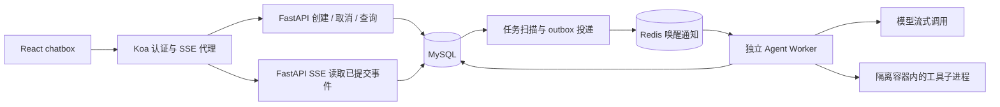

# 存储、Agent 服务托管与性能设计

状态：**待实现设计。**

## 现状与改造范围

当前调用链为 React chatbox → Koa `adsAgent.service.ts` → FastAPI `/chat` → 工具/RAG/Agent → 一次性 JSON 响应。广告数据使用 JSON 文件；`memory/conversation_memory.py` 使用 Redis 工作记忆与 Chroma 长期记忆；`core/action_decision.py` 使用 Redis 加进程内兜底保存待澄清、待确认状态。`mcp/tool_manager.py` 已有 `asyncio.wait_for`，但取消协程不等于清理子进程。

本设计新增 MySQL 持久化、独立 Agent Worker、SSE 事件接口及隔离工具执行器。现有广告分析工具和四态预检继续复用。涉及真实数据写入的工具仍必须完成权限检查和审批；现有出价模拟不能当成真实调价。

## 14.3 存储与中间件

### 职责划分

| 组件 | 存储内容 | 丢失或故障后的处理 |
| --- | --- | --- |
| MySQL | 用户、workspace、成员关系、Agent session、run、message、tool call、approval、memory、audit log、事件与投递记录 | 业务事实源；备份、增量日志和恢复演练；不可用时停止接收新 run 和新工具执行 |
| Redis | 登录 session、最近上下文缓存、查询缓存、限流计数、Worker 唤醒通知 | 缓存可由 MySQL 重建；登录 session 丢失须重新登录；不可用时拒绝新 run，已运行任务通过 MySQL 继续检查取消与截止时间 |
| 对象存储 | 大型工具输出、附件、workspace 检查点、历史归档 | MySQL 保存对象键、大小、校验值、状态；下载前鉴权并签发短期地址 |
| Chroma | 由已持久化 memory 派生的向量检索索引 | 可重建；不承担 session 历史和审批的唯一存储 |

这里的登录 session 存 Redis；Agent session 的状态和历史存 MySQL。Redis 不是 Agent 会话的唯一副本。生产模式移除审批和任务状态的进程内兜底，避免多实例分别作出决定。

建议使用 MySQL 8 系列、InnoDB、UTC `DATETIME(6)` 和 `utf8mb4`；上线前锁定经验证的具体版本。主键使用服务端生成的 `BIGINT` ID，对外序列化成字符串，避免 JavaScript 整数精度丢失。表中保留 `created_at`，可变实体增加 `updated_at` 和 `version`。以下为逻辑表设计，正式迁移需另行实现。

### 表结构与索引

`user_id` 表示会话归属用户，`actor_id` 表示实际操作者。所有查询先校验认证身份与 workspace 成员关系，不能信任请求体中的 `user_id` 或仅凭难猜的 ID 授权。

| 表 | 主要字段 | 必需索引 / 约束 |
| --- | --- | --- |
| `users` | id、auth_subject、status | PK(id)，UNIQUE(auth_subject) |
| `workspaces` | id、owner_id、name、storage_prefix、status、version | PK(id)，INDEX(owner_id, id) |
| `workspace_members` | workspace_id、user_id、role | PK(workspace_id, user_id)，INDEX(user_id, workspace_id) |
| `agent_sessions` | id、user_id、workspace_id、title、status、active_run_id、next_seq、version | PK(id)，INDEX(user_id, updated_at, id)，INDEX(workspace_id, updated_at, id) |
| `agent_runs` | id、user_id、workspace_id、session_id、status、idempotency_key、request_hash、resumed_from_run_id、worker_id、lease_until、fence_token、deadline_at、cancel_requested_at、checkpoint_ref、error_code、started_at、finished_at | PK(id)，UNIQUE(user_id, idempotency_key)，INDEX(session_id, id)，INDEX(status, next_dispatch_at, id)，INDEX(status, lease_until, id)，INDEX(user_id, status, id)；另含 next_dispatch_at |
| `messages` | id、user_id、session_id、run_id、seq、role、content_preview、content_ref、content_bytes、is_partial | PK(id)，UNIQUE(session_id, seq)，INDEX(run_id, id) |
| `tool_calls` | id、user_id、session_id、run_id、seq、tool_name、args_preview、args_ref、status、deadline_at、sandbox_id、exit_code、term_signal、stdout_preview、stderr_preview、output_ref、output_bytes、truncated、started_at、finished_at、side_effect_key、error_code | PK(id)，UNIQUE(session_id, seq)，INDEX(run_id, id)，UNIQUE(user_id, side_effect_key)；无副作用调用的 key 为 NULL |
| `session_records` | session_id、seq、record_type、record_id | PK(session_id, seq)；message/tool call 的统一历史目录 |
| `approvals` | id、user_id、workspace_id、session_id、run_id、action_name、args_hash、status、expires_at、decided_by、consumed_at | PK(id)，INDEX(run_id, status, id)，INDEX(status, expires_at, id) |
| `memories` | id、user_id、workspace_id、session_id、kind、summary、content_ref、source_record_id、version、expires_at | PK(id)，INDEX(user_id, workspace_id, kind, id)，INDEX(session_id, id) |
| `audit_logs` | id、workspace_id、actor_id、session_id、run_id、action、target_id、result、metadata_preview | PK(id)，INDEX(workspace_id, created_at, id)，INDEX(run_id, id) |
| `run_events` | run_id、event_seq、type、payload_preview、payload_ref、created_at | PK(run_id, event_seq)；短期重放，独立于 message 数量 |
| `outbox` | id、run_id、event_type、published_at、attempts、next_attempt_at | PK(id)，INDEX(published_at, next_attempt_at, id) |
| `runtime_capacity` | scope_type、scope_id、running_count、waiting_count、version | PK(scope_type, scope_id)；保存 global/user/host 容量，事务内检查和更新 |

同一 session 的 `next_seq` 在事务内加一，同时写入 message/tool call 及 `session_records`，形成统一、不可变的历史顺序。状态迁移、终态消息、审计和对应事件在同一事务提交。终态不得被延迟回调改写；更新须带 `status + version/fence_token` 条件。

审批绑定用户、workspace、session、run 和动作参数哈希；执行前重新校验权限、有效期、参数是否变化，通过条件更新保证审批只消费一次。审批过期不等于任务执行失败，记录独立原因。日志不得保存密钥、Cookie 或完整认证头。

### Redis key 与一致性

| Key | 内容 | 初始 TTL / 上限 |
| --- | --- | --- |
| `auth:session:{token_hash}` | user_id、认证版本、绝对过期时间 | 闲置 24 小时，最长 7 天；注销立即删除 |
| `context:{user_id}:{session_id}:{version}` | 最近消息与摘要 | 30 分钟，单项最多 256 KiB |
| `session:list:{user_id}:{version}:{cursor_hash}` | 首页或分页列表缓存 | 30 秒；先完成权限校验 |
| `ratelimit:{user_id}:{minute}` | 创建 run 请求数 | 2 分钟，原子递增 |
| `worker:wakeup` | 可执行任务提示 | 有界 Redis Stream，最多 10,000 条；不作为任务事实源 |

写入先提交 MySQL，再由 outbox 刷新缓存版本和发送唤醒通知；失败重试。Worker 同时扫描 MySQL 中到期的 queued 任务，通知丢失不丢任务。终态、审批、取消查询直接读主库，不依赖可能过期的缓存。Redis 只做请求频率限制；运行名额由 MySQL 事务保证，不能靠进程内 semaphore 或易过期的 Redis 计数保证跨实例上限。

### 大输出与保留策略

- message、工具参数及 stdout/stderr 的数据库预览字段分别限制为 8 KiB；按 UTF-8 字节截断并保存 `truncated`、原始字节数、校验值和对象引用。预览是截断文本，语义摘要另存，不能把摘要当完整原文。
- 工具 stdout + stderr 单次完整归档上限 10 MiB。达到上限后继续排空管道但丢弃额外内容，记录实际读取字节数；避免管道阻塞或把内容无限攒在内存。单次 run 最多归档 50 MiB，workspace 默认磁盘配额 1 GiB。
- message 单次输入上限 64 KiB；更大内容走附件上传。模型输出设 token 上限；事件合并后每批最多 8 KiB、每 run 最多 10,000 条，触顶则停止并记录 `event_limit_exceeded`。
- 对象先写临时键并校验成功，再提交数据库引用；异步清理无人引用的临时对象。存储失败必须标记 `output_unavailable`，不能返回假下载链接；执行命令的退出结果仍单独保留。
- 初始策略：SSE 增量事件保留 7 天，原始工具输出保留 30 天，message/tool 元数据在线保留 180 天，审计保留 365 天。更早历史先归档清单与对象，校验可恢复后再分批清理；session 记录保留归档范围，客户端明确提示。所有期限可配置，容量估算还需覆盖未归档的最坏情况。

## 14.4 Agent 服务托管

### 执行链与职责



HTTP 服务负责快速鉴权和提交任务；长时间运行的 Agent 由独立 Worker 托管，API 重启不等于杀掉所有任务。开发可在同一台机器部署，但 Worker 和工具容器必须有独立资源配额。多个用户可并发；同一 session 初始限制只有一个非终态 run，第二次创建返回 409，避免两个 run 同时修改上下文和 workspace。

### 创建、调度与生命周期

1. Koa 从认证信息确定用户，FastAPI 验证可信内部身份及 workspace 权限。`POST runs` 必带 `Idempotency-Key`；同 key、同请求返回原 run，不同请求哈希返回 409。
2. 在 MySQL 事务中按固定顺序锁定用户行和 session 行，检查排队上限、session 活跃 run；插入用户消息、`queued` run、审计、outbox，并设置 `active_run_id`。返回 202 和 `run_id`。
3. 调度器轮转用户，用户内按创建时间调度；队列截止时间到达时终止，不能无限等待。涉及容量变更的所有事务统一按 global capacity → user capacity → user → session → run → host capacity 顺序加锁（不涉及的行跳过）；Worker 在同一事务占用名额并将 queued 改成 running。容量计数和 run 一起释放，周期性对账，避免多实例超卖与重复释放；创建时也按此顺序检查全局等待上限。
4. Worker 记录 `worker_id`、租约、递增的 `fence_token`，每 5 秒续租，租约初始 20 秒；每次写状态及发起工具都校验租约和 token。长调用期间续租独立执行，工具启动由隔离执行器再次验证 token。
5. Worker 读取 MySQL 历史与检查点，执行预检、工具、模型调用，将事件分批提交；完成后在事务中写终态消息、checkpoint、审计、终态事件，清空 session 的 `active_run_id` 并释放容量槽。

状态转换：

```text
queued  -> running | cancelled | timed_out
running -> waiting_approval | succeeded | failed | stopping
waiting_approval -> queued | cancelled | timed_out
stopping -> cancelled | timed_out | interrupted | failed
```

`succeeded / failed / cancelled / timed_out / interrupted` 为不可变终态。运行中取消、超时、租约丢失都先进入 stopping，携带最终原因；失败时如仍有子进程，也先进入 stopping。清理完进程再提交终态。waiting_approval 保存检查点并释放运行名额，但仍占用户等待任务配额并阻止同 session 新 run；审批后回 queued，重新抢名额。澄清可作为本次 run 的成功回复结束，待澄清数据持久化后由下一次 run 继续。

### 流式输出：SSE

采用 SSE：创建/取消仍走普通 HTTP，服务端单向推送 token 增量、工具状态和最终结果。模型客户端、编排器、FastAPI、Koa、chatbox 必须整条链路支持流式；不能等旧 `/chat` 返回后再分割字符串假装流式。

```text
POST /api/agent/sessions/{session_id}/runs
GET  /api/agent/runs/{run_id}/events
GET  /api/agent/runs/{run_id}
POST /api/agent/runs/{run_id}/cancel
POST /api/agent/runs/{run_id}/resume
POST /api/agent/approvals/{approval_id}/decision
```

事件类型为 `run.queued`、`run.started`、`assistant.delta`、`tool.started`、`tool.output`、`tool.finished`、`approval.required`、`run.finished`。只推送可展示的阶段状态、工具摘要与回复，不返回模型隐藏推理。格式示例：

```text
id: 42
event: tool.finished
data: {"run_id":"123","event_seq":42,"tool_call_id":"456","status":"succeeded","exit_code":0,"truncated":false}
```

- 每个 run 的 `event_seq` 递增，事件先落 MySQL，再推 SSE；token/output 按 100 ms 或 8 KiB 合并，避免逐 token 写数据库。
- 重连携带 `Last-Event-ID`，从 MySQL 补发后续事件，再接实时事件；客户端按 `(run_id, event_seq)` 去重。多实例不得只靠 Redis Pub/Sub，因为它不能补发断线内容。
- 事件超过保留期返回 410，附 run 快照及历史接口，客户端重新同步最终消息。终态事件缺失时可查询 run；不要无限等待最后一个 token。
- 每 15 秒发送 SSE 心跳；Koa 和 Nginx 关闭代理缓冲、及时 flush，读取空闲超时大于心跳间隔。每用户最多 5 个事件连接。
- 慢客户端每连接缓冲最多 256 KiB，超出则断开并让客户端重连补发，不阻塞 Worker。页面断开不取消 run，只有明确 cancel 才触发停止。
- 同源 HttpOnly Cookie 鉴权；修改接口校验 CSRF。若采用 Authorization header，用 fetch 读取流，不把 token 放 URL。

### 取消、超时与竞争处理

初始限制均为可调参数：排队最多 5 分钟；run 从首次启动起最多 10 分钟，含等待审批且 resume 审批不重置截止时间；普通工具 30 秒、test 工具 120 秒；模型单次请求最多 120 秒且连续 30 秒无数据终止。工具实际 deadline 取工具上限和 run 剩余时间的较小值，不能晚于 run deadline。

取消接口幂等：queued 直接 cancelled；running 写入 `cancel_requested_at` 并进入 stopping；已经终态则返回实际状态。取消和成功通过同一行锁/CAS 竞争：先提交的状态决定结果，取消已生效后晚到的模型回复不能写成功。

Worker 每秒检查取消；关闭模型流、停止新工具派发，通知执行器对整个进程组发 SIGTERM，等待最多 3 秒后 SIGKILL，并回收容器内剩余进程。必须并行读取 stdout/stderr、等待退出、关闭管道、删除临时资源，记录退出码、信号、截断标志、终止原因、部分输出和结束时间。工具超时后记 `tool_calls.status=timed_out`，初始策略为停止整个 run，避免自动重试有副作用动作。

清理失败保留 stopping 并报警；宿主容量槽在确认隔离环境已销毁前不释放，不向用户谎报“已干净停止”。独立执行器/watchdog 必须能在 Worker 崩溃时清理到期容器。正常情况下取消清理完成目标为 5 秒以内，需用孙进程和忽略 SIGTERM 的命令验证。

### 工具执行隔离与资源控制

单纯设置 `cwd=workspace` 或检查命令字符串不能阻止越界。生产 shell/test 必须运行于受限容器：非 root、只读根文件系统、仅挂载本次 run 的 workspace 副本；不挂载宿主目录、Docker socket、云凭证；关闭特权、丢弃 capabilities，配置 no-new-privileges、seccomp 及适用的宿主访问控制。Linux 容器作为生产执行边界，本地非 Linux 开发通过受控 Linux VM 运行。

默认禁止网络；确需依赖下载或外部 API 时，通过受限代理显式放行目标，禁止访问宿主与云元数据地址。普通工具用参数数组直接 exec；shell 工具即使允许脚本，也只允许在上述容器内运行。路径使用规范化、符号链接解析与目录边界校验，但隔离仍依赖操作系统边界。

每个工具容器初始限制：1 vCPU、512 MiB 内存、64 PID、256 文件描述符、1 GiB workspace、128 MiB 临时盘；禁用 core dump。每 run 同时最多 2 个工具容器，每宿主最多 8 个，所有孙进程计入 PID/CPU/内存限制。达到 OOM、PID、磁盘限制时记录具体错误；限制日志增长和临时目录，不能只限制 stdout。

同一 workspace 的不同 session 使用独立 run 副本；写回共享 workspace 必须检查基础版本并串行合并，冲突返回明确状态，不覆盖别人的改动。外部有副作用动作在执行前持久化 `side_effect_key`，下游支持幂等时传递同一个 key；不支持幂等且响应丢失时记结果未知，查询或人工确认，禁止自动再做一次。

### 并发、限流与排队

| 范围 | 初始上限 | 超限行为 |
| --- | --- | --- |
| 单用户创建 run | 10 次/分钟 | 429 + Retry-After |
| 单用户执行中的 run | 2 | 新任务 queued |
| 单用户 queued + waiting_approval | 10 | 新任务 429；等待审批不允许无限堆积 |
| 同一 session 非终态 run | 1 | 409，返回已有 run_id |
| 全集群执行中的 run | 16 | queued；按实际资源再调参 |
| 全集群 queued + waiting_approval | 1,000 | 新任务 503 + Retry-After |
| 每宿主工具容器 | 8 | 工具等待容量；等待时间计入 run deadline |

stopping 在清理完成前仍计入运行容量；waiting_approval 的配额转换必须原子化，若等待配额已满则结束本次 run 并说明原因，不能绕过上限。所有入口，包括 resume 和审批恢复，都复用相同的配额检查。按用户轮转取任务，避免单用户占满队头。队列长度、最老等待时间和资源使用率共同用于扩容，不把“10,000 个用户”误解成“10,000 个并发 Agent”。

### 重启恢复与 resume

session 列表、历史、审批、摘要从 MySQL 恢复；Redis 丢失不丢历史。检查点保存：最后完成步骤、关联 message/tool ID、模型与工具版本、workspace 对象版本、待审批动作和已知副作用结果。

Worker 启动时扫描租约过期的 running/stopping run。先撤销旧 token 并请求执行器销毁对应容器；确认清理后标记 interrupted，释放名额。执行器在无法续租时按本地截止时间主动停止，恢复器在无法确认旧沙箱停止时不得开启同一执行路径。等待中的 queued 任务重新调度；waiting_approval 从数据库恢复并重新检查是否过期。

`POST /resume` 只针对可恢复的 interrupted、cancelled、timed_out、failed run，创建新 run，记录 `resumed_from_run_id`，保留旧 run 终态。重新鉴权、检查 workspace 版本和审批有效性、获取名额，从最后已提交检查点继续；没有检查点则从持久化对话发起新一轮。成功的纯读取步骤可在数据版本仍一致时复用；未知结果的写操作先核对，不自动重放。恢复的是业务步骤和历史，不是恢复原来的 Python 调用栈或已死掉的 shell。

## 14.5 数据规模与性能

### 容量基线

10,000 用户 × 100 session = **1,000,000 session**。按每 session 的 message/tool call **合计 1,000 条**计算，为 **1,000,000,000 条业务记录**。如果要求 message 和 tool call 各 1,000 条，业务记录升至 20 亿，容量按两倍计算。`session_records` 目录额外有对应数量的索引记录；run_events、audit、memory 不包含在这 10 亿条里。

仅按每条业务记录平均 1 KiB 估算，正文与元数据约 0.93 TiB；加目录、二级索引、页空间后暂按 2–3 倍预留，主库约 1.9–2.8 TiB；一份完整副本后约 3.8–5.6 TiB，尚未含备份、binlog、事件和对象存储。此为规划假设，必须用真实行宽、工具占比和索引大小校正；8 KiB 是单字段上限，不是平均值承诺。

不能让所有 session 常驻 Redis。只缓存活跃数据，设置全局内存上限；登录 session、限流等与可淘汰缓存分实例，前者禁止因普通缓存挤压而随意淘汰，后者采用可淘汰策略。示例：10,000 个活跃上下文 × 64 KiB 已约 625 MiB，仍需计入 Redis 自身开销。

初始部署采用单 MySQL 主库、只读副本、独立备份与对象存储；这不代表单实例已验证能扛 10 亿行。表从一开始携带 user_id；若全量数据下索引、存储或维护窗口不达标，再按 user_id 路由到多个 MySQL 分片，同用户 session/消息/工具保持同片，workspace 成员信息走独立元数据服务，避免跨片历史查询。分片是条件方案，上线前必须完成全量容量验证或明确分阶段容量边界。

### 分页与查询接口

```text
GET /api/agent/sessions?limit=20&cursor=...
GET /api/agent/sessions/{session_id}/history?limit=50&cursor=...
GET /api/agent/sessions/{session_id}/messages?limit=50&cursor=...
GET /api/agent/sessions/{session_id}/tool-calls?limit=50&cursor=...
```

limit 上限 100；采用游标分页，查 `limit + 1` 判断 has_more，禁止深 OFFSET 和每页全表 COUNT。cursor 携带排序键、查询过滤条件和版本并签名；服务端重新鉴权，不能把 cursor 当授权凭证。正文只返回预览，需要全文时单独取对象。

session 列表示例（首屏省略游标条件）：

```sql
SELECT id, workspace_id, title, status, updated_at
FROM agent_sessions
WHERE user_id = :user_id
  AND (updated_at < :cursor_time
       OR (updated_at = :cursor_time AND id < :cursor_id))
ORDER BY updated_at DESC, id DESC
LIMIT :limit_plus_one;
```

session 排序字段可变化，因此列表定义为实时列表：客户端按 id 去重，下拉刷新获取新活跃 session；翻页期间发生更新的项目可能移到首页，不承诺静态快照。要求稳定遍历时提供按不可变 id 排序的接口。

统一历史先读目录，再按类型批量取对应记录，禁止逐行发查询：

```sql
SELECT seq, record_type, record_id
FROM session_records
WHERE session_id = :session_id AND seq < :cursor_seq
ORDER BY seq DESC
LIMIT :limit_plus_one;
```

messages/tool-calls 单类型接口分别使用 `(session_id, seq)` 索引。所有路径先校验 session 归属和成员权限。已归档区间返回归档状态及加载入口，不能默默显示“没有更多”。预计索引定位成本随表规模呈对数增长，实际取数随页大小增长；必须用 EXPLAIN ANALYZE 确认扫描行数、排序和回表情况，索引存在并不等于达标。

### 查询性能验收

以下都是**待压测目标**：session 列表 20 条、历史 50 条，在 100 HTTP QPS、50 并发压测连接下，服务端 P95 ≤ 200 ms、P99 ≤ 500 ms、错误率 < 0.1%；分别记录缓存命中/未命中、冷/热数据，不包含模型生成、对象下载和 SSE 长连接。

压测报告必须固定并公开 CPU/内存/磁盘、MySQL 版本与配置、连接池、索引大小、数据规模、缓存命中率、Agent 后台负载以及压测持续时间。建议先用 100 万 session + 1,000 万历史记录验证计划，再用目标 10 亿记录验证容量与性能；小数据结果不得外推成全量结果。持续 30 分钟，分别测首屏、深游标、活跃 session 并发写入、不同用户分布及跨用户越权请求。每个 Worker 的连接池有限额，所有进程连接数总和小于 DB 连接预算。

### 典型 Agent 任务的耗时与瓶颈

模型调用独立统计排队时间、首个可见回复增量、模型请求耗时、token 数、工具次数和总耗时，不能将一次耗时几十秒的 run 填进普通 HTTP QPS 结论。统一 trace_id 贯穿 Koa、FastAPI、Worker、工具和对象上传，记录单调时钟 duration；数据库 UTC 时间用于跨进程对齐。

以“分析广告表现并模拟出价”为基线用例，提供下面的**演算示例，不是实测数据**：

| 阶段 | 假设耗时 | 记录方式 |
| --- | --- | --- |
| 创建任务、鉴权和落库 | 50 ms | API span |
| 排队 | 200 ms | queued → started |
| 读取记忆与预检 | 300 ms | context/preflight span |
| ads_summary | 20 ms | tool_call 1 |
| ad_performance_search | 40 ms | tool_call 2 |
| bid_simulation | 30 ms | tool_call 3 |
| knowledge_search | 150 ms | tool_call 4 |
| 最终模型调用 | 5,000 ms | model span，内部首个增量假设 800 ms |
| 最终消息落库 | 60 ms | persist span |
| 总计（按串行演算） | 5,850 ms | API 接收 → 最终提交 |

示例共 4 次顶层工具调用；首个回复增量约 1,590 ms，模型约占总耗时 85%。这些仅用于说明计算方法；真实调用数依输入分支变化，检索重写、rerank、重试或预检模型调用均需独立子 span，不能藏在一个工具名字后面。并行工具按关键路径计算总耗时，不把各耗时直接相加；缓存命中也要单独计数。实际瓶颈要依 trace 判断，可能是模型、排队、检索或工具启动，不能预设所有请求都是模型慢。

验收时交付一条真实任务的 trace 和至少 100 次同类任务的 P50/P95、工具实际执行/缓存命中/失败次数；模型型号、输入长度、输出长度和运行并发保持可比，单次 trace 不证明稳定性能。

## 实施顺序与完成标准

| 阶段 | 项目改动位置 | 完成条件 |
| --- | --- | --- |
| 1. 持久化 | 新增数据库迁移与 repository 层；改造 `memory/conversation_memory.py`、`core/action_decision.py` | MySQL 保存历史/审批/审计；Redis 清空后历史可恢复；重复创建和审批消费不会重复执行 |
| 2. Worker 与生命周期 | 从 `api/main.py` 拆出 run API、调度器、Worker；改造 `agents/agent_orchestrator.py` | 多实例不会重复领取、超卖名额；取消、超时、租约丢失都可落终态；重启后可 resume |
| 3. 工具执行器 | 扩展 `mcp/tool_manager.py`；新增隔离执行器和 watchdog | 孙进程、超时、OOM、fork 风暴、大输出、路径与网络越界测试通过；资源清理可观测 |
| 4. 流式前后端 | 改造 `adsAgent.service.ts`、前端 `api.ts`、`AIAssistantPanel.tsx` 及代理配置 | 运行中可见中间事件与增量回复；取消按钮有效；断线重连无丢失或重复展示 |
| 5. 容量与性能 | 扩展 compose、监控指标、数据生成与压测脚本 | 交付分页执行计划、实际压测报告、典型任务 trace 和故障恢复记录 |

还需覆盖取消与成功竞争、审批过期、Redis 宕机、MySQL 暂不可用、对象写入失败、Worker 在工具完成但落库前崩溃、重复 outbox 投递。DB 故障时 Worker 不启动新工具，停止现有执行并由 watchdog 保证资源清理；恢复后对照执行器结果和检查点补录 interrupted/未知结果，而不是虚构成功。只有代码、端到端验证和压测证据齐备，才能将本文件中对应能力标成已实现。
