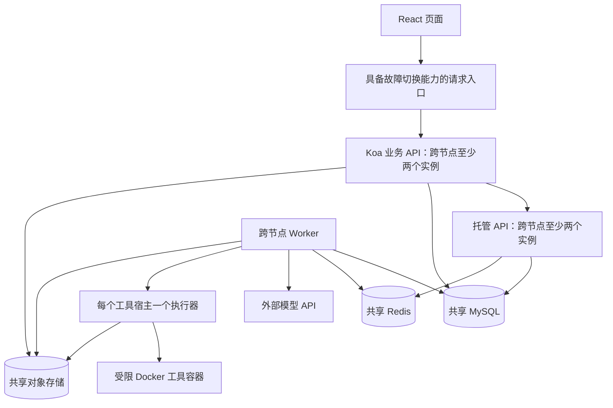

# MiniAdsWall 后端可靠性与扩容修复 SDD

版本：0.1  
日期：2026-10-10  
状态：待实现、待验收。本文中的性能和恢复时间是设计目标，不是已有成绩。  
范围：修复当前源码审查发现的七类缺口，保留 Koa 业务后端、Python 托管 API/Worker 和 React 前端。

## 1. 设计目标与边界

让多个业务 API 和 Worker 在不同机器上共享业务状态、领取任务、定位工具执行位置，并在进程故障后安全恢复；让广告数量、SSE 连接数和上传负载增长时，接口成本仍有明确上限。

本次修复共享状态、锁范围、进程归属、部署和验证；后续选型必须有瓶颈数据。

必须保留的既有行为：

- 广告写入、操作结果和审计在 MySQL 事务中一起提交；重复操作返回首次结果。
- 广告更新检查版本，点击数原子递增；存储故障返回明确错误。
- 身份由 Koa 验证；浏览器不能指定他人身份、伪造广告事实或绕过工具审批。
- Agent 只提供分析和模拟；本次不增加广告删除、调价等模型驱动写工具。
- 同一 session 只有一个非终态 run；运行容量在清理完成前不得提前释放。
- 租约失效后的旧 Worker 不得继续提交事件、工具结果或最终结果。
- SSE 事件持久化，可按序号补发；shell/test 的结果未知时不得自动重放。

旧文档的地位：本文覆盖下表七项修复；其他业务行为沿用当前代码和 [托管实现说明](agent-hosting-implementation.md)、[广告 MySQL 说明](ads-mysql.md)。[早期托管设计](agent-hosting-design.md) 中“广告仍用 JSON”“只有一次性聊天”等描述已过时，不能作为本次现状依据。

## 2. 缺口与需求映射

| 编号 | 当前事实与证据 | 修复要求 |
| --- | --- | --- |
| G01 | [托管 Compose](../docker-compose.hosting.yml) 是单机拓扑；API、Worker、MySQL、Redis 无跨节点切换配置 | 可部署双应用节点，明确数据库和 Redis 的故障策略，验证节点故障和滚动发布 |
| G02 | [Koa 托管代理](../apps/mini-ad-wall/server/routes/agent.routes.ts) 附带全部广告；[RunInput](../hosting/api.py) 最多接受 1,000 条。此次参数验证中 1,001 条被拒绝 | 改为服务端全量统计加有限明细，广告总数不再决定提交请求大小 |
| G03 | [Repository.tx](../hosting/repository.py) 所有托管事务都锁全局容量行，部分对象读写在锁内 | 全局锁仅保护容量转换；事件、心跳等用实体锁或条件更新；对象 I/O 移出事务 |
| G04 | [素材上传](../apps/mini-ad-wall/server/services/upload.service.ts) 使用本地目录；[Objects](../hosting/objects.py) 未配置 bucket 时使用本地文件 | 多节点模式强制共享对象存储，素材地址与上传状态不依赖节点磁盘 |
| G05 | [SandboxClient](../hosting/sandbox.py) 使用固定地址；[Executor.cleanup](../hosting/executor.py) 只清理本机 Docker | 持久化工具执行归属，按执行器路由，不能把另一台机器上“没找到容器”当成回收成功 |
| G06 | [分片合并](../apps/mini-ad-wall/server/services/chunk-upload.service.ts) 同步读文件且不等待写入背压；[SSE](../hosting/api.py) 每连接空闲轮询数据库 | 上传采用有界流或对象存储直传；SSE 按 run 合并读取，慢客户端有界 |
| G07 | [查询记录](hosting-query-smoke.json) 是约 10 秒、1 session、3 条历史的 SQLite 测试；[监控配置](../config/prometheus.yml) 只采集旧服务 | 建立 MySQL、双节点、持续负载和真实 Docker 故障验收；覆盖托管 API、Worker、执行器指标 |

历史 MySQL 竞争和 Worker SIGKILL 验证见 [记录](hosting-mysql-validation.json)，它证明特定测试条件下的正确性，不替代本 SDD 的多节点与容量验收。

## 3. 目标架构



Koa 和托管 API 都不持有必须依赖粘性路由的业务事实。现有 Koa 登录 token 缓存可以保留，但必须可重新获取，不能成为任务或用户状态的唯一副本。

第一阶段仍使用 MySQL 任务表领取任务。Redis 通知只帮助及时发现变化，不能成为任务、结果、审批或 SSE 事件的唯一副本。

## 4. 正确性约束

以下约束优先于吞吐和故障恢复速度。

| 编号 | 必须始终成立 |
| --- | --- |
| INV01 | 已返回成功的广告写入和已接受的 run 均可从持久状态查到；幂等键与不同请求内容绑定时返回 409 |
| INV02 | 所有副本共用容量配置；默认全局 running + stopping ≤ 16，单用户 ≤ 2，同 session 非终态 ≤ 1 |
| INV03 | queued + waiting_approval 默认全局 ≤ 1,000、单用户 ≤ 10；创建、恢复、审批和终态转换不能绕过限制 |
| INV04 | 工具副作用未知或未确认清理时保持 stopping；不能恢复该步骤、释放执行名额或宣称停止完成 |
| INV05 | Worker 写入同时校验 run 状态、执行代次、租约和截止时间；旧代次结果被拒绝 |
| INV06 | SSE 相同序号只对应同一事件；通知丢失可以补读，客户端按序号去重 |
| INV07 | 明细截断、对象不可用、权限变化和结果未知均显式表达；不能用部分广告样本冒充全量统计 |
| INV08 | 数据库事务内不得发起模型调用、Docker 操作、对象上传下载或其他网络请求 |

租约、任务和执行器失效判断统一使用 MySQL 服务端时间，进程内耗时用单调时钟。保留现有 Unix 秒字段，不在本次顺带重写时间类型。

模型并发门与 run 容量分开：16 个运行中的 run 不代表允许同时调用 16 次模型。模型配额继续独立配置并验证。

## 5. 广告上下文与查询修复（G02）

### 5.1 新输入协议

浏览器仅提交 message、经校验的广告筛选条件、可选广告 ID 和工具请求。Koa 用认证身份确定可读范围，删除客户端提供的 ads/ad_context，再生成受信任的 ad_context。

```json
{
  "message": "分析当前广告表现",
  "ad_context": {
    "version": 1,
    "captured_at": "2026-10-10T00:00:00Z",
    "scope": "authorized_ads",
    "summary": {
      "total_ads": 1200,
      "total_clicks": 3000,
      "average_price": 10.5,
      "ads_without_video": 20
    },
    "items": [],
    "selection": {
      "strategy": "ranking_topk",
      "limit": 50,
      "truncated": true,
      "omitted_fields": []
    }
  }
}
```

上述数量只演示字段含义，不是测试结果。总量、点击和平均值从数据库对完整授权范围做聚合；items 只作为有限明细。

具体限制：

- 默认明细 50 条，硬上限 100 条；显式广告 ID 同样受上限和权限检查。
- ad_context 的 UTF-8 JSON 大小最多 64 KiB。先去除不需要的正文和媒体明细，仍超限则减少 items，并记录截断原因；不截断 ID、数值或 JSON。
- 整个 run 输入继续遵守现有 256 KiB 上限；message 保留字节上限校验。
- 无筛选时按当前排名选择有限明细；显式 ID 优先。文本筛选先实现有界数据库查询，不新增未经验证的语义排序。
- 聚合与明细在同一个短只读快照事务中读取，事务结束后序列化及上传对象。重请求不得持锁处理正文。

### 5.2 工具与幂等

ads_summary 改为消费 summary；表现查询和出价模拟消费 items，并在返回中标明样本范围。若问题涉及样本之外的具体广告，需要再次通过受限服务端查询获取，不能编造数据。

保存首次提交时生成的上下文。幂等指纹只包含用户意图、筛选条件、目标 session、工具参数及 resume 来源，不包含 Koa 每次生成的 ad_context；同一键重试返回首次 run 和首次上下文。

旧 input_ref 中的 ads 数组由兼容适配器读取并标记为 legacy_snapshot，不改写已有历史。恢复继续使用原输入；新上下文协议升级不能改变旧 run 的含义。

### 5.3 广告列表

新增有界广告列表接口，默认 50、最大 100 条，并让页面按页加载。使用带签名的排名值与 ID 游标，游标绑定筛选条件；排名变动时允许结果变化，客户端按 ID 去重，不承诺跨请求静态快照。

旧返回数组接口在兼容窗口中继续存在，但不得用于新 Agent 请求或正式容量验收；所有仓库内消费者迁移后再停用。列表空结果、无权限、无匹配广告都必须区分处理。

## 6. 事务与任务调度修复（G03）

### 6.1 缩小全局锁范围

将普通事务与容量事务分开，禁止普通事务隐式获取 runtime_capacity 的全局行锁。

| 操作 | 锁与更新要求 |
| --- | --- |
| 创建/恢复 run、领取 run、审批恢复、进入 waiting_approval、进入终态 | 在短容量事务中原子检查配额和状态；先保留全局容量行锁，禁止直接删除容量保护 |
| 写 run 事件 | 仅锁目标 run；原子分配 event_seq，同事务插入事件 |
| 心跳续约 | 带 fence_token、合法状态和未过期租约条件的 UPDATE；受影响行数不为 1 即失去执行资格 |
| 保存 checkpoint | 先写不可变对象，再条件更新 run 的引用；冲突时对象成为待回收候选 |
| 写会话消息/工具记录 | 锁 session 后锁 run，原子分配 seq；不获取全局容量锁，除非同时发生容量转换 |
| 普通查询与 SSE 补读 | 无全局容量锁，查询数量和页大小有界 |
| 上传/发布 workspace | 校验对象与上传在锁外；事务中检查基础版本、权限和引用并更新；版本改变返回 409 |

统一锁顺序：容量行（仅需要时）→用户容量行（需要时）→session→run→tool/approval。多行同类实体按 ID 排序；任何路径不能反向补锁。事件或心跳只触及 run 时不再触及 session。

容量事实仍从受保护的任务状态读取，不先增加一套未经验证的计数副本。默认 16 个 run 下先验证短容量锁；只有领取吞吐确实成为瓶颈，才另写容量分区/槽位设计。

锁升级分两步发布：先让全部托管状态写入者使用统一实体锁，仍保留旧全局锁；确认 API、Worker、执行器和维护命令全部升级后，再启用缩小全局锁范围的模式。未升级写入者不得与新模式并存，不能只更新 Worker 就切换锁模式。

claim 每批扫描数量单独配置，不直接等于整个排队上限；建议起始 100，保持用户轮转策略，记录扫描量、跳过原因和最老等待时间。不得为了提高领取速度让一个用户长期占据队头。

### 6.2 对象写入和提交

对象不可变，以内容哈希作为键。流程为：读取输入并校验→在锁外写对象→短事务重新校验版本/权限/执行代次→提交引用和事件→事务结束后通知。

如果事务失败，不发布该对象引用；记录或扫描孤立对象，经至少 24 小时宽限、两次引用检查后回收。不能在提交失败时删除可能被其他记录引用的同哈希对象。

创建 run 的并发重试、幂等冲突、session_busy、对象存储失败和事务回滚均须覆盖。允许留下暂时不可见的孤立对象，不允许数据库指向尚未成功写入的对象。

死锁重试只重试无外部副作用的短事务，最多 3 次，带随机退避。提交结果未知时按幂等键或目标实体查单；不得把整个模型或 shell 执行重跑一遍。

## 7. 共享素材与有界上传（G04、G06）

### 7.1 存储模式

新增明确的 development 与 multi_node 部署模式：

- development 可使用本地目录，界面和运行说明明确其单机限制。
- multi_node 启动时必须提供共享对象存储配置；素材和托管对象均不得静默回退本机目录。对象服务不可达则相关服务不就绪。
- 广告记录使用稳定 asset ID/对象键；公共素材 URL 由配置的访问域名生成，私有 workspace 和工具输出仍需鉴权，不能因为统一存储而公开。
- 数据库记录对象键、大小、内容类型、校验值、所属用户、状态和创建时间；业务引用只允许 ready 对象。

### 7.2 上传协议

新增 /api/uploads 初始化、/api/uploads/:id/parts 签发分片地址、/api/uploads/:id/complete 完成、/api/uploads/:id/abort 取消接口。客户端直传共享对象存储，Koa 不持有整个视频或整个合并文件。

创建上传必须鉴权；分片签名绑定 upload ID、对象键、分片序号及有效期。完成接口向存储服务校验分片、总大小和校验值，成功后再以幂等事务标记 ready。已有幂等键重试返回首次完成结果，参数变化返回 409。

不能把 multipart ETag 一律当成整文件 MD5/SHA-256。优先使用所选对象服务支持的完整性校验；若服务不支持，则通过有界流读取验证，在验证结束前保持 verifying，不能信任客户端声明就标记 ready。

初始可配置限制：单文件 500 MiB、常规分片 5 MiB、单用户最多 2 个未完成上传、客户端同时最多 4 个分片；实际分片要求以选定对象服务为准。上传会话 24 小时过期，定期中止未完成上传并清理 staging 对象。

旧 /api/upload 与分片接口在迁移窗口提供有界流式适配，不使用同步文件读写，不把整个文件装进内存；无法适配的旧客户端返回明确升级错误。正式多节点环境禁止“先写本机，稍后再传共享存储”。

所有 Node 写入路径用可等待的流式管道处理背压和断开，限制总字节、并行请求、超时和缓冲区。上传取消后清理 staging；合并失败不能留下可引用的半成品。

### 7.3 历史文件迁移

生成本地文件→对象键→广告引用映射，逐个核对长度和哈希，再更新引用；保留原文件和映射用于回滚。重新运行迁移不重复发布同一素材。不改写用户提供的外部 URL。

切换前冻结旧本地上传入口，处理仍在途的分片；A 节点上传后必须能从 B 节点访问，并在 A 节点退出后继续访问。

## 8. 多宿主工具归属与异常回收（G05）

### 8.1 新增持久记录

| 表或字段 | 内容 |
| --- | --- |
| executor_nodes | executor_id、instance_epoch、内部 endpoint、状态、租约到期时间、容量、协议版本、最近故障 |
| tool_calls 新增字段 | execution_id、executor_id、executor_epoch、cleanup_status、cleanup_confirmed_at、cleanup_error |
| tool_executions | execution_id、tool_call_id、run_id、run_fence_token、执行器归属、sandbox_id、状态、硬截止时间、清理证据 |

execution_id 唯一；sandbox_id 由 execution_id 确定，重试同一执行请求不能创建第二个容器。执行器 endpoint 只能来自受信任注册配置，浏览器和模型不能提供。

executor_id 标识宿主，instance_epoch 标识执行器本次启动。重启后仍扫描该宿主旧 epoch 的容器，不得只检查新进程创建的容器。

### 8.2 分配和执行

1. 以数据库服务端时间筛选健康执行器，选择有容量的节点。
2. 在短事务中锁执行器行并核对实际未确认清理的执行数，持久化 execution_id 和归属；没有容量时有界等待，时间计入 run deadline。
3. 事务外调用指定执行器。请求绑定 tool_call_id、execution_id、run_fence_token 和参数哈希；执行器校验归属和当前租约后启动容器。
4. 请求/响应丢失时按 execution_id 查单。同执行 ID 请求幂等；若无法确认是否已启动，则保持结果未知，不换宿主重新执行。
5. 保存工具结果和 workspace 快照；确认进程和容器清理完成后，才释放工具容量，必要时再把 run 置终态。

Docker socket 仍只由宿主可信执行器持有；保留当前无网络、非 root、只读根文件系统、CPU/内存/PID 和工作区限制。

### 8.3 取消、崩溃和网络分区

- Worker 取消或租约失效时先撤销旧写入资格，再向记录的执行器发回收请求。对整个进程组先 TERM，宽限 3 秒后 KILL，完成退出等待，并移除对应容器。
- 清理回复绑定 execution_id、executor_id、epoch、宿主上容器不存在的核验和时间。另一个宿主“未找到该容器”的回复无效。
- 执行器 watchdog 独立于 Worker，扫描过期、旧代次和旧 epoch 容器；启动时先扫描孤儿，再允许接收新任务。
- 执行器不可达时保持 stopping 和容量占用，产生告警。只有原宿主确认清理，或基础设施提供可信宿主隔离/关机证据后，才能释放。
- 数据库拒绝旧结果只能防止写回，不能证明旧进程已经停止；禁止用 fence_token 替代清理确认。
- shell/test 的未知结果不自动重放。只读广告任务可用既有检查点，通过显式 resume 创建新 run；旧 run 的终态不修改。

此机制选择在网络分区时保守停等。下文 60 秒恢复目标只适用于执行器可达或无需工具回收的 Worker 故障，不承诺不可达宿主的强制回收时长。

## 9. SSE 读取与背压修复（G06）

保留 MySQL 持久事件和 Last-Event-ID，增加每个托管 API 实例内部的按 run 共享读取器：

1. Worker 提交事件后发送“run_id + 最新 event_seq”通知。通知只在数据库提交后发送；通知失败不回滚已提交结果。
2. API 每个 run 使用一个共享读取器，同一实例上的多个连接共享实时补读；新连接的历史补发按其游标有界读取，不把任意历史积压缓存到内存。
3. Redis Pub/Sub 唤醒共享读取器；重复通知按序号合并。每个活跃 run 另有 2 秒一次的兜底检查，Redis 断开时继续从 MySQL 补读。轮询数随活跃 run 数增长，而不是随连接数增长。
4. 共享读取器使用有限批次和缓存；每连接缓冲最多 256 KiB。客户端过慢则关闭连接，重连补发，不能拖住其他连接。
5. 心跳每 15 秒，重新核对会话有效性；连接结束立即释放 Redis 连接票据，保留现有过期兜底。

前端收到重复 event_seq 时跳过；刷新恢复、切换会话和 SSE 重连不得重复拼接 assistant.delta。事件已清理仍返回 410，前端恢复持久历史并明确提示进度事件过期。

全局限制（新增，起始建议值）：每个托管 API 最多 500 个 SSE 连接、每用户仍最多 5 个；达到上限返回 429 和 Retry-After。最终值必须跟随文件描述符、内存和压测结果调整。

## 10. 多节点部署与依赖故障策略（G01）

### 10.1 部署要求

- 至少两个独立应用节点，每个节点部署 Koa、托管 API、Worker；启用工具时每宿主一个执行器。
- 请求入口本身采用受管理的高可用负载均衡，或具备主备切换的入口；一个 Nginx 容器不能作为高可用验收的唯一入口。
- MySQL 使用具备自动故障切换和旧主隔离能力的托管集群/主备方案。迁移通过独立部署步骤执行，应用启动不并发改表。
- Redis 使用经验证的托管高可用方案或带 Sentinel 的多节点部署；连接目标必须支持切换，不固定连接某个旧主 IP。
- 对象存储是共享外部服务。镜像、依赖、环境配置和数据库版本固定；所有实例使用同一权限、配额和模型门配置。
- Compose 保留用于本地集成。新增多节点部署模板和操作手册；仅同机模拟通过时，报告中明确写“多进程”，不能写“跨机器高可用”。

### 10.2 就绪、退出与发布

新增区分进程存活与依赖就绪的探针。数据库、必要认证存储不可用时从请求入口摘除，不因数据库短暂故障不断重启进程。

Koa/API 停止接收新请求后排空普通请求；SSE 通知客户端重连，保留持久游标。Worker 停止领取任务，按配置宽限完成或进入 interrupted/stopping，并继续执行必要回收。默认退出宽限 30 秒，超时不伪报清理成功。

数据库连接池按所有 API、Worker、执行器、迁移和维护进程的总连接预算配置；预留至少 20% 运维余量。固定副本和最大扩容数量都写入部署配置，不能只调大单实例连接池。

### 10.3 故障策略

| 故障 | 行为 |
| --- | --- |
| MySQL 不可用/切换中 | 新业务写和新 run 返回 503；不能确认执行资格时停止新增工具执行，旧结果需重新核对后写入 |
| Redis 不可用 | 可选上下文缓存绕过；登录、限流和模型准入不可绕过，相关新请求明确拒绝；已持久化任务与历史不丢 |
| Redis 模型门状态丢失/切换 | 不假定旧并发票据仍安全；暂停新模型准入，共享恢复状态持久化，确认旧调用结束或等待最大执行租约后再重建 |
| 对象存储不可用 | 新上传/需要对象的 run 返回明确错误；不回退本地文件，不提交不存在的对象引用 |
| 模型超时/限额 | 记录可区分的错误，遵守有限等待和队列上限；不自动重复生成未知结果 |
| 执行器失联 | 按第 8 节保留 stopping，记录归属与回收错误；其他健康执行器可接收独立的新任务 |

Redis 模型门恢复等待至少覆盖其 execution + grace 上限。滚动升级和不同模型服务必须共用明确的门配置与命名空间；重建共享状态需要协调，不能各 Worker 自行恢复。此项与 Redis 切换测试一起验收。

## 11. 数据迁移、接口兼容与回滚

以增量迁移增加表/字段和索引，迁移独立执行、可重复检查。DDL 不宣称能靠普通事务回滚。

发布顺序：

1. 增加 schema 和新旧输入读取兼容能力；旧服务尚可继续工作。
2. 部署新 API、Worker、执行器并验证；新协议写入和工具分配功能开关保持关闭。
3. 等旧 run 排空，确认所有可能接管任务的 Worker 都能读取新版上下文；再启用新上下文写入。
4. 迁移并核对共享素材，更新前端上传与广告分页消费者，再切换共享存储写入。
5. 拆分事务锁、启用 SSE 共享读取与多节点部署；每阶段独立验收。

新输入与新版工具归属启用后，只允许回滚到能读取这些数据的兼容版本。旧 Python Worker 遇到未知输入版本不能领取后误执行。工具执行记录存在时，不允许撤掉执行器归属校验并恢复固定地址路由。

存储回滚只能停止新写入、修复配置或切回仍可读共享对象的兼容版本；不能把新的对象键重新解释为某节点本地路径。失败发布不得破坏广告、审计、历史和已确认结果。

迁移检查保存：schema 版本、迁移批次、旧新文件映射、对象校验值、记录数量、失败项和回滚可用版本。备份恢复必须在隔离环境演练，并核对数据库引用对应的对象实际存在。

## 12. 监控与告警（G07）

新增 Koa、托管 API、Worker、执行器采集端点及数据库/Redis/对象依赖监控，不复用旧 Agent 的指标来代替托管链路。Worker 可使用独立只读监控端口；监控不可成为执行服务的公共入口。

| 范围 | 必须采集 |
| --- | --- |
| API | 按路由模板的吞吐、P50/P95/P99、状态码、在途请求、数据库池等待、Koa 事件循环延迟 |
| 调度 | queued/running/stopping/waiting_approval 数、最老排队时间、领取耗时、容量锁等待、拒绝原因 |
| SSE | 连接数、每活跃 run 数据库补读次数、事件落库到推送延迟、缓冲大小、慢连接关闭、补发失败 |
| Worker | 心跳失败、租约丢失、执行代次冲突、阶段耗时、恢复时长、模型准入等待和调用错误 |
| 执行器 | 宿主租约、工具运行数、孤儿容器数、清理失败与耗时、超时/OOM/输出截断 |
| 存储 | 上传吞吐、未完成上传数、对象读写错误、孤立对象数、连接池和慢查询 |

指标标签使用路由模板、阶段、状态和有限错误类型，不用 run_id/user_id/session_id 作为 Prometheus 标签。日志和 trace 才记录 request_id、run_id、tool_call_id、execution_id 和执行器归属；不得记录凭据、完整上传签名或无必要的广告正文。

初始告警：存在超期租约待处理、清理失败、孤儿容器、对象完整性错误时立即告警；API 5xx 超 1% 持续 5 分钟、最老排队超 60 秒、容量锁 P95 等待超 100 ms 持续 5 分钟时告警。正式阈值随验收基线调整。

## 13. 验收环境、目标与证据

### 13.1 固定测试环境

以下是初始验收规格，执行时可因预算调整，但必须先修改规格再测，不能测完倒改目标：

- 两台独立 Linux 应用节点，每台至少 4 vCPU/8 GiB；记录 CPU 型号、容器限制、网络位置和镜像版本。
- 独立 MySQL 8.4 高可用测试环境、共享 Redis 和 S3 兼容对象存储；记录拓扑、复制方式、连接预算和故障切换配置。
- 数据：100,000 条广告、100,000 个 session、1,000,000 条历史记录，另有实际 workspace 与素材对象；包含 10/1,000/100,000 条历史的不同长度会话，记录分布、索引、对象大小和 EXPLAIN。
- 性能测试与真实模型测试分开。容量验收使用可控制延迟、输出速率和错误的模型服务；报告必须标明模拟。真实模型另测供应商配额和成本，不折算成后端 HTTP 吞吐。
- 测试数据库、对象前缀和凭据独立，禁止在已有业务数据上清库或注入破坏性故障。

### 13.2 初始目标

| 项目 | 待验收目标与计数口径 |
| --- | --- |
| 有界广告页、session 页、history 页 | 各路由分别 200 请求/秒，200 客户端并发上限；预热 5 分钟、测量 30 分钟；P95 ≤ 200 ms、P99 ≤ 500 ms，非预期错误率 ≤ 0.1% |
| run 提交 | 可控模型每 run 约 5 秒，测试模型门配置为 12 并记录所有预检调用，足够独立用户和 session，稳定提交 2 run/秒；接口 P95 ≤ 500 ms，默认全局 16/单用户 2 上限不被突破。真实模型不直接套用这个门配置 |
| SSE | 100 条连接、至少 20 个用户、每用户最多 5 条；运行/排队/等待审批任务均可承载连接，轮换终态任务保持负载 30 分钟并记录实际事件率；正常通知下事件提交到客户端 P95 ≤ 1 秒，遗漏通知后 ≤ 3 秒补发 |
| 模型门 | 在多 Worker 下不超过单独配置的模型调用上限；故障恢复不能偷偷切本地门 |
| 大文件 | 两个用户各传 500 MiB 文件，同时保持查询负载；查询 P95 相比无上传基线增加 ≤ 20%，进程内存不按总文件大小累积 |
| API 节点故障 | 健康节点继续服务；入口摘除故障节点 ≤ 15 秒，客户端恢复 SSE ≤ 30 秒，已提交业务结果不丢 |
| Worker 进程被 SIGKILL | 在依赖和执行器可达时 ≤ 60 秒收敛到可解释状态；可恢复只读任务能显式 resume；旧 Worker 结果被拒绝 |
| 工具取消 | 执行器可达时 ≤ 10 秒确认进程/容器回收；超时保留 stopping，不提前释放名额 |
| MySQL 切换 | 目标 ≤ 120 秒恢复业务入口；已确认写目标 RPO=0，必须有对应持久化/复制保证和故障验证。异步主备不能仅凭部署存在就宣称达到 |

配额内成功请求、故意制造的 429/503、依赖故障期间错误分别报告，不能删除错误样本美化延迟。记录实际到达吞吐、完成吞吐、客户端排队延迟和服务端资源，避免把压测器限速当作服务容量。

### 13.3 必须执行的验收用例

| 编号 | 场景 | 通过条件 |
| --- | --- | --- |
| AC01 | 广告 0/1,000/1,001/100,000 条提交 Agent run | 请求大小有界，无数量引发的 422；全量统计准确，明细截断可见 |
| AC02 | 伪造 ads、ad_context、身份或未授权广告 ID | 客户端事实不被使用，权限范围不可扩大 |
| AC03 | 广告变化后，同幂等键并发重试 | 只有一个 run/首次输入；不同意图复用键返回 409 |
| AC04 | 两节点多 Worker 竞争、取消、审批和恢复交错 | 全局/用户/session/排队配额始终成立，旧结果拒写；已保存的 MySQL 六项回归仍通过 |
| AC05 | 对象服务注入 5 秒延迟，再并发续约和写事件 | 网络 I/O 不持数据库锁；无由该 I/O 引起的全局停顿或错误租约丢失 |
| AC06 | 多线程/进程并发写同 run 事件与 session 记录 | 序号无重复，记录和状态事务一致，无锁顺序循环 |
| AC07 | A 节点上传，B 节点读取；A 节点停止 | 已确认素材和托管对象仍可用；迁移数量/哈希/引用一致 |
| AC08 | 上传重试、断开、分片缺失、完成响应丢失 | 不重复发布，不引用半成品，能查单并清理 staging |
| AC09 | 多执行器启动请求响应丢失，再按同执行 ID 重试 | 同工具最多一个有效容器，执行归属持久可查 |
| AC10 | Worker 换节点恢复，原工具在另一宿主 | 向原宿主清理；错误宿主空结果不能确认完成 |
| AC11 | 执行器重启、孙进程忽略 TERM、输出洪泛、OOM | watchdog 与进程组回收可观察；缓冲有界；无遗留容器，错误类型准确 |
| AC12 | 工具宿主网络分区，Worker 仍可访问数据库 | 保持 stopping 与名额，产生告警；确认清理/宿主隔离前不重放未知副作用 |
| AC13 | 100 SSE 连接、重复/丢失通知、慢客户端 | 同 run 共享读取；事件可补发且前端去重；慢连接不拖累其他连接 |
| AC14 | API 故障与滚动退出、浏览器刷新重连 | 历史、审批和任务可从另一实例恢复；已确认业务操作不重复 |
| AC15 | Redis 断开、重启丢状态、故障切换 | 缓存可绕过，准入不绕过；模型门恢复不突破上限；历史不丢 |
| AC16 | MySQL 故障切换、提交响应丢失 | 新请求明确失败/查单，旧主写入被隔离；确认结果符合声明的 RPO |
| AC17 | 大数据持续查询/run/SSE/上传负载 | 达到第 13.2 节对应目标，锁等待、内存、连接和队列不持续增长 |
| AC18 | 备份恢复、迁移重复执行、兼容版本回滚 | 业务/历史/审计和对象引用可核对，失败阶段可定位，无新协议误读 |
| AC19 | 中止发布、输入协议混合和旧任务恢复 | 新 Worker 可读历史；不兼容 Worker 不领取新输入，旧 run 含义不变 |
| AC20 | 监控和告警故障注入 | 能从 request/run/execution 关联定位失败阶段，告警实际触发，指标标签基数有界 |

Docker 用例必须运行真实 Docker 和工具镜像；MySQL 用例必须运行真实 MySQL；跨机器用例必须记录不同宿主。环境不满足时标记 skipped，不计入通过。

## 14. 实施顺序与交付物

| 阶段 | 主要改动位置 | 完成条件 |
| --- | --- | --- |
| P0：基线与回归 | 既有 tests、scripts/verify_hosting_mysql.py；新增可重复数据生成和契约测试 | 记录当前版本、数据规模与已有回归；固定 AC01 的数量边界复现 |
| P1：有界广告上下文 | Koa ads.model/services、agent.routes、hosting/api.py、pipeline.py、广告工具、前端广告分页 | AC01–AC03；新旧输入兼容，首次快照幂等 |
| P2：共享存储与上传 | Koa 上传服务/前端上传工具、hosting/objects.py、业务资产迁移、部署配置 | AC07–AC08；A 上传 B 读取；多节点配置拒绝本地回退 |
| P3：事务锁与 SSE | hosting/repository.py、schema/migrations、worker.py、api.py、客户端事件消费 | AC04–AC06、AC13；回归配额正确性，外部 I/O 全部在锁外 |
| P4：多宿主执行器 | hosting/executor.py、sandbox.py、worker.py、schema/migrations、Docker 故障用例 | AC09–AC12；持久归属、幂等启动、准确回收确认 |
| P5：部署、监控和发布 | 多节点部署模板、探针、配置校验、config/prometheus.yml、告警与运维手册 | AC14–AC16、AC18–AC20；备份恢复和兼容回滚演练 |
| P6：容量验收 | 扩展 benchmark_hosting.py、混合负载与故障脚本、验收报告 | AC17 及全部必需用例；区分模拟模型、真实模型、多进程和跨机器证据 |

每阶段的状态初始均为 pending。阶段交付包括实现、必要回归、实际执行结果和运行说明；本 SDD 创建完成不等于修复完成。

建议新增文件：docs/backend-reliability-acceptance.md、deploy/multi-node/、scripts/seed_reliability_dataset.py、scripts/benchmark_reliability.py、scripts/verify_reliability_failures.py。路径是计划交付物，尚未存在不构成验收通过。

每份验收报告必须保存 Git revision、环境/数据/负载、目标与实际值、错误和跳过项、故障时间线、持久状态核对、容器回收证据。不能只保存截图或“服务重启成功”。

## 15. 完成定义

完整验收要求：七项缺口都有对应实现；INV01–INV08 保持；AC01–AC20 在规定环境中全部通过；正常连通条件下无超期遗留执行记录/容器，故意制造网络分区时的 stopping 与告警符合 AC12；跨节点存储、故障切换、容量和回滚有可复现证据。

有失败、跳过或缺少规定环境的用例时，只能交付阶段性结果，逐项列出未达目标及影响，不标记本 SDD 完整验收通过。

只有应用代码通过测试时，称“修复实现完成”；完成真实多节点和持续负载验收后，才能称“在已记录环境与负载下验证了高可用和并发容量”。未通过或跳过的项目持续标记，不用换框架或增加服务数量替代证据。
