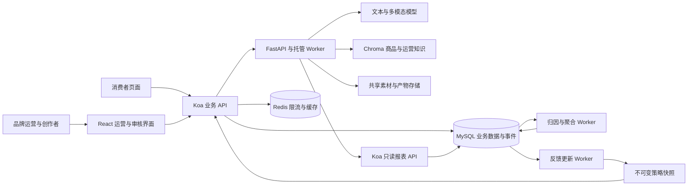

# MiniAdsWall 智能营销系统 SDD

- 版本：0.1
- 日期：2026-10-10
- 状态：设计稿，新增能力尚未实现
- 目的：将广告运营 AI 助手逐步扩展为可追踪创意、分发、操作与效果的营销系统。
- 基线：当前工作区代码，包括尚未提交的广告 MySQL 改造；本文件不代表部署或性能验收结果。

## 1. 要解决的问题

品牌提出营销目标后，运营需要把商品信息交给创作者、审核素材、制定投放方案，再根据效果调整。现有项目已经支持广告管理、文本创意生成、工具分析和托管对话，但缺少曝光、转化与花费记录，无法判断建议有没有带来收益。

本设计围绕一条业务链路推进：

> 品牌明确目标 → 商品与创作者素材进入系统 → AI 辅助理解和生成创意 → 审核并发布 → 分发并记录效果 → Agent 提出有依据的调整 → 运营确认执行 → 对比后续效果。

技术结果与商业结果分别验收：请求成功、数据准确、操作可恢复属于技术结果；人工耗时下降、转化成本下降属于业务结果。模拟数据只能证明流程与计算正确，不能证明真实营销收益。

## 2. 当前基线与缺口

| 能力 | 当前实现 | 本设计新增内容 |
| --- | --- | --- |
| 广告管理 | React/Koa；广告 CRUD、视频上传与点击累加 | Campaign、商品、创作者、独立素材版本及生命周期 |
| 广告存储 | MySQL；事务、操作幂等、版本检查、审计 | 事件、归因、账本、报表、业务动作提案 |
| 内容生成 | 文本输入，生成标题、正文、视频脚本文本 | 品牌约束、商品事实引用、素材理解与人工审核 |
| 广告分析 | 后端固定调用摘要、表现检索、加价模拟 | 带时间范围、数据覆盖与证据的效果诊断 |
| 加价模拟 | 提价后重算 `price + price * clicks * 0.42` | 保留为旧规则演示；新增策略回放，禁止将分数变化称为收益预测 |
| Agent 操作 | 只读分析；修改请求不会真实写广告 | 结构化提案、确认、Koa 执行、查单和结果回传 |
| 托管任务 | MySQL 生命周期、Worker、租约、检查点、SSE | 复用现有机制，接入新分析工具与业务执行回执 |
| 效果度量 | 累计点击；无完整曝光、转化、花费链路 | 事件去重、订单回传、归因、指标及实验报告 |
| 精准分发 | 固定分数排序 | 受众条件过滤、可解释排序、频控与策略版本 |
| 在线学习 | 尚无营销反馈驱动的学习链路 | 基于已去重反馈更新素材选择策略的小规模实验 |
| 规模验证 | 有历史本地正确性验证记录 | 固定规模压测、故障注入与对账；亿级容量另行立项 |

源码基线：

- [广告数据与事务](../apps/mini-ad-wall/server/models/ads.model.ts)、[现有表结构](../apps/mini-ad-wall/server/migrations/001_ads.sql)。
- [生成接口](../api/generation.py)、[只读广告工具](../mcp/ads_tools.py)。
- [同步聊天链路](../api/main.py)、[当前前端使用的托管 Pipeline](../hosting/pipeline.py)。
- [Koa 认证代理](../apps/mini-ad-wall/server/routes/agent.routes.ts)、[业务认证与幂等](../apps/mini-ad-wall/server/middlewares/businessBoundary.ts)。
- [Worker](../hosting/worker.py)、[托管 Repository](../hosting/repository.py)、[模型并发门](../core/model_gate.py)。

当前静态凭据可以映射运营身份，但不等于品牌归属、创作者角色和完整多租户权限。旧文档中仍有 JSON 存储或完整营销闭环的描述，实施时须按上述代码基线更新。

## 3. 范围与实施顺序

### 3.1 本轮设计覆盖

1. 效果事件与统一指标。
2. 品牌需求、商品事实、创作者信息与素材审核。
3. 图片/视频内容理解和有事实依据的创意生成。
4. Agent 修改单条广告出价的完整执行链路。
5. 小规模受众匹配、分发实验、模拟预算与反馈更新。

### 3.2 独立后续工作

外部广告交易平台接入、真实扣款结算、跨平台用户身份匹配、生产反作弊、模型训练平台、海量流处理和亿级吞吐验收不包含在首版交付中。后续要接入实时竞价，可参考 [IAB OpenRTB](https://iabtechlab.com/standards/openrtb/)；当前广告排序不视为实时竞价。

### 3.3 阶段门槛

| 阶段 | 交付 | 进入下一阶段的条件 |
| --- | --- | --- |
| S1 效果数据 | 最小 Campaign/Creative 关联、展示凭证、事件去重、归因、账本导入、报表 | 固定数据集精确对账；重复和乱序事件不造成重复计数 |
| S2 内容生产 | 品牌需求、商品、创作者、素材理解、生成和审核 | 事实引用可追溯；未审核素材不可分发 |
| S3 Agent 执行 | 有证据的诊断、出价提案、确认、执行及回查 | 跨实例重复执行、确认失效、超时恢复用例通过 |
| S4 分发策略 | 受众匹配、频控、实验分组、模拟预算和策略回放 | 分发决策可重放；并发扣减不超预算；曝光与策略版本可关联 |
| S5 反馈学习 | 基于反馈的素材选择、策略冻结、实验报告与停用 | 重复反馈不重复学习；旧策略可回滚；明确离线和真实业务证据 |

S1 即可单独交付。先使用人工创建的品牌、商品和素材记录，无需等待多模态模型接入。各阶段使用开关，上一阶段通过验收后再开启下一阶段。

## 4. 核心业务规则

### 4.1 角色与归属

- 品牌运营：维护需求、Campaign、预算与投放策略。
- 创作者：提交归属自己的素材草稿和授权信息。
- 审核者：批准或退回素材，不能因模型建议自动通过。
- 消费者：访问展示页面，产生曝光、点击与订单。
- 系统接入方：以服务身份回传订单、花费或模拟反馈。

S1 使用现有运营登录与服务身份，保存 `brand_id` 和创建者；S2 增加角色授权及品牌资源归属检查后再开放创作者入口。品牌角色独立于现有 hosted workspace，不通过 workspace ID 推断广告权限。

### 4.2 Campaign 与素材

- Campaign 指广告活动，具有目标、起止时间、状态和关联商品。
- 第一版目标为 `traffic` 或 `conversion`。品牌曝光目标后续需要独立指标，不能用点击率替代。
- Campaign 状态：`draft → active → paused → ended`；恢复 active 需要重新检查时间、素材与预算条件。
- Creative 指可独立追踪的素材版本；修改已发布内容生成新版本，不覆盖历史版本。
- Creative 状态：`draft → pending_review → approved/rejected → archived`；只有 approved 且未过期的授权素材可分发。
- S1 人工登记素材并记录审核人；S2 接入正式审核界面。
- legacy 广告关联新 Campaign 与 Creative 后才能进入新效果报表；未关联数据仅在旧广告墙展示。

### 4.3 品牌与商品事实

营销需求至少包含目标、目标受众、商品、时间、预算、语气、必提卖点和禁止表述。缺少目标或商品依据时，系统先追问。

商品事实按条目保存，包含 `fact_id`、事实内容、来源、有效期和版本。生成稿涉及价格、功效、销量等事实时，必须给出对应 fact_id；没有来源则作为待补信息，不生成确定性承诺。

创作者资料保存内容领域、受众描述、来源和更新时间。第一版由人工录入，不能把自填受众描述当成真实平台受众统计。

## 5. 效果事件、归因与指标

### 5.1 展示与点击链路

1. 页面向 Koa 请求展示候选；S1 按现有规则选取已关联素材，S4 替换为新策略。
2. Koa 记录 serving decision，生成 `impression_id` 和短期签名展示凭证，绑定 Campaign、Creative、版本、访问会话及实验组。
3. 页面在素材至少 50% 面积可见且连续 1 秒时上报曝光。该阈值是本项目的产品口径，不宣称符合行业测量认证；隐藏标签页停止计时。
4. 同一个 impression_id 最多记一次曝光，组件重新渲染不重新计数；新展示机会使用新 ID。
5. 点击经 Koa 跳转入口验证展示凭证，首次点击生成 click_id，再跳转已登记落地页；同一 impression_id 的重复访问返回同一 click_id，不新增有效点击。客户端不得指定任意跳转目标。
6. 订单接入方回传 order_paid；浏览器不能提交可信订单金额或花费。

签名凭证只能限制伪造和跨素材串报，不能证明是真实人类流量。演示环境保留数据来源标签，真实流量反作弊另行验收。

### 5.2 通用事件字段

| 字段 | 约束 |
| --- | --- |
| event_id | 上报重试保持相同；同来源唯一 |
| type | `impression`、`click`、`order_paid`、`order_refunded` |
| source / source_event_id | 来源由凭据确定；来源事件标识用于去重 |
| occurred_at / received_at | UTC 时间；接收时间由服务端填写 |
| campaign_id / creative_id / creative_version | 展示凭证或订单关联回填，不能信任客户端任意指定 |
| impression_id / click_id | 展示与点击关联；允许点击先于曝光到达 |
| visitor_session_id | 服务端签发的匿名会话；首版不进行跨设备归因 |
| order_id | 支付事件必填；由接入方身份限定唯一范围 |
| amount_minor / currency | 订单金额为整数分；首版固定 CNY |
| environment | `synthetic`、`sandbox`、`production`，凭据绑定，报表不可混算 |
| schema_version / payload_hash | 用于格式演进和幂等冲突检查 |

事件接收成功的条件是 MySQL 已持久化。去重成功返回原 receipt；同一事件标识换内容返回 409。未知素材、错误凭证、非法时间或金额返回明确错误，不进入有效指标。

事件时间默认允许未来偏移不超过 5 分钟、回传延迟不超过 30 天；越界进入隔离记录，由接入方校正后以可追踪的更正流程处理。该阈值可配置，并写入报表口径版本。

### 5.3 第一版归因

- 方法：同一匿名访问会话、支付前 7 天内的最后一次有效广告点击归因。
- eligible click 必须属于同一 environment，并匹配订单商品；取 occurred_at 最新一条，相同时间按 click_id 确定稳定顺序。
- 订单时间由支付回传确定，不能用回传接收时间替代。
- 无匹配点击记录为 unattributed，不分配到任意 Campaign。
- order_paid 按接入方与 order_id 去重；归因记录保存 click_id、规则版本和关联证据。
- 同一订单只归因一个素材；点击本身不得重复计费或重复进入反馈更新。
- 点击晚到、订单先到时，后台重算受影响订单；更正通过新归因 revision 和聚合差额完成，不能再加一笔转化。
- order_refunded 引用原订单；首版支持唯一退款事件和累计退款金额，累计退款不得超过支付金额。

规则采用滚动重算窗口：按 received_at 找到新增或更正事件，再按事件时间重算受影响分区和订单。超过自动窗口的数据标记为待核对并支持显式重建。报表展示 revision、截止接收时间和“可能有迟到回传”，不把旧日报永久视为完整结果。

### 5.4 花费与预算

花费来自可信接入方导入或 S4 模拟账本，不来自模型文本或浏览器字段。账本流水至少保存来源、唯一业务键、Campaign、Creative、计费时间、整数金额、币种、环境和更正引用。

S1 支持可信 spend 与 spend_adjustment 导入；不可按 price × clicks 自行假定实际花费。source 与 source_entry_id 唯一，同标识换金额返回 409；更正追加流水，不覆盖原流水。缺少完整花费回传时，成本指标显示“花费数据不完整”。

每个 Campaign 登记预期花费来源。接入方完成一个时间区间的导入与对账后，提交该区间的 completion marker，含来源、环境、范围、流水数量、总额与校验摘要；Koa 验证账本匹配后才记录 complete。任一预期来源缺失、未完成或被更正使 marker 失效，该区间即为 incomplete。不能凭“数据库查到一些费用”推断数据完整。模拟种子也必须提交此标记。

S4 的预算为模拟余额，只用于验证控制机制。第一版采用 CPC 模拟：每次唯一有效点击扣固定单价，单价在展示决策中冻结；一次 impression 最多产生一笔模拟计费。模拟单价必须为整数分且满足 Campaign 上限。

### 5.5 指标定义

报表必须指定环境、时间范围 `[start, end)`、时区、素材版本、归因规则和聚合 revision。展示默认 Asia/Shanghai，存储与查询边界转换为 UTC。

| 指标 | 定义 | 数据不足时 |
| --- | --- | --- |
| CTR 点击率 | 区间唯一有效点击数 / 区间有效曝光数 | 曝光为 0 返回 null |
| 点击后 CVR | 区间点击所归因的已支付订单数 / 区间有效点击数 | 点击为 0 返回 null；归因窗口未结束标记 provisional |
| CPA 转化成本 | 区间计费时间的花费 / 区间支付时间的归因订单数 | 花费覆盖不完整或订单为 0 返回 null |
| ROAS 广告支出回报 | 区间支付时间的归因订单净收入 / 区间计费时间的花费 | 花费覆盖不完整或花费为 0 返回 null |
| 退款率 | 区间支付订单中有退款的订单数 / 区间支付订单数 | 明确退款回传截止时间 |

CPA/ROAS 首版是运营周期口径，分子与分母按各自事件时间入窗，可能存在跨期错位；不能将其解释为同一点击人群的因果收益。CVR 使用点击人群口径，报表必须同时返回点击窗口与归因观察截止时间。退款修订原支付订单所在分区的净收入，保留旧 revision。

原始指标允许多个订单归于一次点击，因此 CVR 可能超过 100%；需要衡量购买人数时使用独立的去重购买人数指标，不能静默替换公式。曝光缺失导致 CTR 异常时保留原值并标记数据质量问题，不强行截断到 100%。ROI 需要利润数据，首版不输出 ROI。

Agent 读取同一报表接口计算结果，不自己从零散文本算指标。报表返回缺失来源、样本量、数据新鲜度与口径说明。

## 6. 内容理解与创意生成

### 6.1 输入与处理

- 输入：商品事实版本、品牌需求版本、创作者资料版本、素材对象 ID。
- 图片：读取登记图片，识别商品、场景、画面文本与可见卖点。
- 视频：先读取时长、抽帧和音轨；第一版最多 60 秒，每 5 秒抽帧并补首尾帧，最多 14 帧；转写覆盖音轨。限制为设计默认值，不能声称理解每一帧。
- 输出：结构化事实、事实来源、帧时间或文本位置、抽样覆盖、冲突与待人工检查项。
- 原始素材哈希、模型版本、提示词版本、分析版本和产物对象引用必须保存。

优先复用现有上传与对象存储能力，跨宿主部署使用共享对象存储。分析任务复用 hosting Worker，使用独立并发额度和超时；不在 Koa 请求或数据库事务内运行模型。

### 6.2 事实与推断分离

每条结论标记为 `observed`、`product_fact` 或 `inferred`，并附证据引用。模型声称“画面出现某商品”必须引用帧；声称“该商品具有某功效”必须引用商品事实。模型置信分数仅作提示，不能替代事实来源或人工确认。

创意生成返回多个版本，每个版本包含标题、正文、脚本、使用的商品事实、品牌约束检查及待审核项。素材与商品事实冲突时阻止发布；审核者确认后形成不可变 Creative 版本。

### 6.3 验收

- 建立开发集与独立冻结评测集，冻结集至少包含 30 组商品/素材，覆盖图片、视频、卖点冲突、无依据功效和画面文字。
- 测量有依据事实的准确率、无依据事实数量、品牌约束通过率、生成失败率、人工修改时间与单次成本。
- 首版发布门槛：冻结集中的关键无依据事实必须被阻止发布，不能把“提示词要求不编造”当作验收通过。
- 与当前纯文本生成对比时固定输入、模型和人工审核口径；通过率和耗时写实际结果，不预写提升比例。

## 7. Agent 诊断与业务执行

### 7.1 分析工具

新增只读工具：

| 工具 | 输入 | 输出 |
| --- | --- | --- |
| campaign_metrics | Campaign、时间、环境、口径版本 | 指标、样本量、coverage、revision |
| creative_evidence | Creative 版本 | 素材理解、商品事实与审核记录 |
| campaign_compare | 可比较的 Campaign/实验组及区间 | 指标差异、限制与不足样本提示 |
| strategy_replay | 历史候选集、上下文、策略版本 | 决策差异；不将未展示候选的未知效果补成真实收益 |
| propose_bid_change | 广告 ID、新出价、理由及证据引用 | 待确认提案，不修改广告 |

默认仍由后端规则选择分析工具，保留可解释的固定调用链。需要模型动态选择工具时另设有限迭代协议、超时与白名单，不因工具注册就宣称实现 ReAct。

诊断输出包含观察到的变化、证据、可能原因、待补数据与建议。仅凭聚合指标无法证明素材疲劳、落地页故障或受众变化的因果关系，必须将这些内容标记为待验证假设。

### 7.2 提案结构

```json
{
  "action": "set_bid",
  "ad_id": "ad_001",
  "expected_version": 7,
  "new_bid_minor": 1200,
  "currency": "CNY",
  "evidence": {
    "report_id": "report_001",
    "revision": 3,
    "start": "2026-10-01T00:00:00Z",
    "end": "2026-10-08T00:00:00Z"
  },
  "reason": "小范围测试；效果仍需后续实验验证"
}
```

Koa 保存提案时补入可信操作者、当前出价、资源归属、参数哈希、创建时间和 300 秒有效期。默认单次涨价幅度不超过 20%，同时受现有 MAX_AD_BID 约束；阈值可配置，配置变更须版本化。

新接口出价使用整数分；调用现有 DECIMAL price 写入逻辑时精确换算。已有超过两位小数的出价保持原值，不静默四舍五入；首版可拒绝此类广告提案并提示人工处理。

### 7.3 执行权与确认

首版选择：Python 生成提案，Koa 保存并执行，前端将确认提交给 Koa。Worker 不持有运营浏览器凭据，也不凭模型生成的 actor 字段取得执行权。

1. Agent 返回结构化草案，Koa 验证身份、归属、当前版本、出价范围和证据引用后保存提案。
2. 前端显示广告、修改前后值、依据、数据时间与提案有效期。
3. 操作者确认时提交 proposal_id、参数哈希和固定 Idempotency-Key。
4. Koa 再次检查权限、提案状态、有效期、参数哈希、广告版本和最新配置。
5. Koa 在同一事务内锁定提案与广告，修改出价，消费提案，保存操作结果、审计及回执 outbox。
6. 事务提交后返回确定结果；outbox 异步把业务回执写入托管会话，按 operation_id 去重。

现有 hosted 审批只能作为 UI/任务状态入口；广告写入批准必须经过 Koa 的上述验证。实施时禁止保留“通用 hosted 审批一通过就等价于广告写入授权”的旁路。

### 7.4 状态与故障

- 提案状态：`pending → executed/rejected/expired/invalidated`。
- 未发送确认前可撤销 pending 提案；正在提交或已提交的变更不保证通过取消聊天撤销。
- 广告版本或执行配置变化使提案 invalidated；重新生成并确认，不能自动套用旧批准。
- HTTP 超时只表示结果未知。前端用原 operation_id 查单，未查明前不生成新幂等键。
- Koa 查不到操作时，可用原键重发，由唯一约束处理与尚未完成事务的竞争；执行参数不得变化。
- Worker 重启或 outbox 重放只补回执，不重做业务变更。
- 同一键同参数返回原结果；同一键不同参数返回 409。
- 已执行变更的回滚是读取最新版本后生成反向提案，再确认执行；不能覆盖后续人工修改。

第一版只开放 set_bid。删除素材、修改预算和批量变更仍拒绝，分别完成数据模型与验收后再加入。

## 8. 精准分发、模拟预算与反馈

### 8.1 候选与排序

分发请求携带服务端匿名会话与当前页面上下文。第一版上下文为显式选择的兴趣类别和页面内容标签，不能将模型推断的人群标签当成经过验证的用户画像。

候选先过滤 Campaign 时间/状态、素材审核/授权、商品关联、受众条件和频次上限。S4 频控默认同一会话对同一 Campaign 一小时最多 3 次已接收曝光；并发展示机会通过短期 reservation 防止同时超限，未曝光 reservation 自动过期。

排序先采用可解释规则：受众匹配程度、素材质量检查、历史平滑点击率与小比例新素材探索。各分项、权重和策略版本记录在 decision 中。候选缺少历史数据时使用显式先验，不将点击总数当点击率。

新策略通过开关启用，旧分数排序仅保留为对照与兼容路径。即使采用估计点击概率与出价排序，也不宣称完成外部广告拍卖或真实收益预测。

### 8.2 模拟预算控制

- Campaign 设置日预算、总预算和 CPC 模拟单价，币种固定 CNY。
- daily 以 Asia/Shanghai 自然日为界；late click 按已签名点击时间进入对应日桶，超过配置回传窗口隔离核对。
- 展示只判断可用余额，最终点击计费时在同一 MySQL 事务内锁定 Campaign 总预算和对应日预算，检查两者余额、唯一计费键后扣减并写流水。
- 锁顺序统一为总预算 → 日预算 → 唯一计费记录；并发失败按同一键有限重试。
- 余额不足时记录 unbilled_budget_exhausted，不扣成负数；展示到点击之间余额可能耗尽，报告此类样本，不宣称已经预约成功。
- 停用 Campaign 后已有展示凭证仍按冻结规则处理有效点击；预算限制始终生效。
- 第一版没有退款恢复预算、跨币种或实际支付渠道。模型建议不能直接变更余额。

### 8.3 实验与学习

- A/B 实验按 visitor_session_id 与 experiment_id 的稳定哈希分组，组别在整个实验期间不变。
- 第一版同一 Campaign 同时只能进入一个分发实验；各组预算独立且总和受 Campaign 预算约束。
- 实验创建时冻结目标指标、窗口、归因规则、流量比例、观察周期和最低样本规则；不能看了结果后换主指标。
- 首个学习版本采用 Beta-Bernoulli Thompson Sampling 比较素材点击概率，初始先验 Beta(1,1)。一次曝光在 24 小时观察窗口内最多形成一次成功/失败反馈；未到期未点击样本不立即当失败。
- feedback 以 impression_id 与学习版本唯一；到期后到达的点击仍进入业务统计，记录为迟到反馈，首版不静默重复更新已封账训练样本。
- 模型状态、训练样本截止时间和策略版本持久化。每分钟发布一次不可变策略快照，分发服务读取快照，不在请求内训练。
- 点击率策略只能声称优化点击选择。转化优化要单独处理 7 天延迟标签、花费与探索成本，再作为下一版目标。
- 真正验证策略收益要使用有对照的真实流量实验；合成回放仅验证策略机制。普通历史日志缺少未展示素材的结果，不能据此声称反事实收益提升。

策略出现错误率或延迟恶化、预算异常、效果越过预设停止阈值时，停用学习快照并切回冻结规则。实验中切回必须记录切换时间，报告受污染区间。

## 9. 技术架构与一致性



### 9.1 服务职责

| 模块 | 职责 | 写入边界 |
| --- | --- | --- |
| Koa | 登录与归属、Campaign/Creative、事件接入、账本、提案执行、分发 | 广告业务权威写入入口 |
| Python Agent | 理解、生成、诊断、提案草案 | 不直接更新广告、预算或账本 |
| hosting | 长任务、取消、租约、SSE 与模型运行 | 复用现有托管表；不承担广告业务事务 |
| 归因/聚合 Worker | 归因修订、分区聚合与对账 | 专用数据库权限，仅写派生归因与报表表 |
| 反馈 Worker | 去重反馈、策略更新与快照 | 仅写反馈状态和策略版本 |
| Redis | 有界限流、缓存与模型并发协调 | 不是账本或事件唯一性权威 |

S1 使用 MySQL 事件表和任务/outbox 表驱动异步处理，先不引入 MQ。每次 Worker 领取有限批次，短事务领取后在事务外计算，再通过租约/版本检查提交派生结果；只有持久化结果成功才推进检查点。

### 9.2 不变量

1. 每个来源事件只进入一次有效计数；每个有效订单只归因一次当前 revision。
2. 事件写入与待处理 outbox 同事务提交。
3. 消费者可重放；“已处理”标记与派生写入同事务提交，重放不重复累加。
4. 广告变更、提案消费、操作结果、审计和回执 outbox 同事务提交。
5. Campaign 日/总余额不为负；账本流水和余额变更同事务提交。
6. 模型、对象上传和远端请求不在数据库事务内执行。
7. 数据库故障不回退到 JSON，不展示未提交操作为成功。
8. 权限、环境与金额字段不由模型或浏览器声明决定。

吞吐不足时先测量连接等待、锁等待、查询与聚合耗时；确认瓶颈后再决定 MQ、列式分析存储或分区方案。增加 Koa 实例需要合并连接预算，不能无限扩连接池。

## 10. 数据模型

以下是逻辑结构，实际 DDL 在各阶段另建迁移，不改已有初始迁移。

| 表 | 主要字段 | 关键约束/索引 |
| --- | --- | --- |
| marketing_brands | id、name、version | 品牌 ID 主键 |
| marketing_memberships | principal、brand_id、role | 三字段唯一；按 principal 查授权 |
| marketing_products | id、brand_id、name、version | brand_id/id |
| marketing_product_facts | id、product_id、version、text、source_ref、expires_at | product_id/version/id |
| marketing_briefs | id、brand_id、product_id、version、objective、constraints、audience | 不可变版本 |
| marketing_creators | id、principal、profile_version、categories、audience_source | principal/id |
| marketing_campaigns | id、brand_id、product_id、brief_version、objective、status、start/end、version | brand_id/status/id |
| marketing_creatives | id、version、campaign_id、creator_id、asset_ref、asset_hash、status、authorization_ref、reviewer | id/version 唯一；campaign/status |
| marketing_ad_links | ad_id、campaign_id、creative_id、creative_version、effective_at | 当前绑定唯一；历史绑定另留 revision |
| marketing_serving_decisions | impression_id、session_id、candidate_ref、selected_version、policy/experiment/version、token_expires、simulated_cpc_minor | impression_id 主键；session/time；快照不可变 |
| marketing_events | id、source、source_event_id、type、event_time、received_at、refs、environment、payload_hash | source/source_event_id 唯一；impression、click 类型分别按 environment/impression_id 去重；environment/type/event_time/id；received_at/id |
| marketing_order_attributions | source、order_id、revision、click_id、rule_version、net_revenue_minor、status | 订单/revision 唯一；当前 revision 指针；click_id |
| marketing_spend_ledger | source、source_entry_id、campaign/creative、occurred_at、amount_minor、adjustment_ref、environment | 来源业务键唯一；campaign/time/id |
| marketing_source_coverage | campaign_id、environment、source、start/end、expected_count/amount、checksum、revision、status | 来源/活动/环境/区间/revision 唯一；记录完整性与失效原因 |
| marketing_daily_metrics | environment、campaign、creative_version、day、rule_version、counts、money、revision、received_cutoff | 聚合维度唯一；按维度重建替换 |
| marketing_campaign_budgets | campaign_id、environment、total_limit_minor、spent_minor、version | campaign/environment 唯一 |
| marketing_daily_budgets | campaign_id、environment、day、limit_minor、spent_minor | campaign/environment/day 唯一 |
| marketing_action_proposals | id、principal、ad_id、expected_version、action、params_hash、evidence_ref、expires_at、status、operation_id | id 主键；principal/status/time |
| marketing_outbox | id、kind、aggregate_id、payload_ref、status、lease、attempt、next_at | kind/aggregate/revision 唯一；status/next_at/id |
| marketing_experiments | id、campaign_id、frozen_config、start/end、status | active Campaign 唯一，事务中校验 |
| marketing_policy_versions | id、campaign_id、algorithm、config、snapshot_ref、sample_cutoff | 不可变版本；campaign/created_at |
| marketing_learning_feedback | impression_id、learning_version、label、deadline、processed_at | impression/learning_version 唯一 |

所有营销资源带环境或关联到固定环境，join 必须检查一致。原始事件为追加记录；更正通过引用原记录追加。聚合允许重建，账本和审计不静默修改。

核心事件、账本、回执 outbox 使用同一广告 MySQL 连接域；若未来拆库，需要另设计跨库一致性，不能沿用“同事务提交”的表述。hosting 可以独立库，通过幂等回执接入。

## 11. API 合约

以下均为待实现接口，现有广告和托管接口保持兼容。

| 阶段 | 接口 | 说明 |
| --- | --- | --- |
| S1 | POST /api/marketing/campaigns | 人工创建最小活动；运营认证与 Idempotency-Key |
| S1 | POST /api/marketing/creatives | 人工登记素材/审核记录与旧广告绑定 |
| S1 | POST /api/marketing/serve | 返回展示凭证；不等于曝光发生 |
| S1 | POST /api/marketing/events/impressions | 浏览器曝光上报，验证凭证并去重 |
| S1 | GET /api/marketing/click/:token | 服务端生成一次点击关联，跳转登记落地页 |
| S1 | POST /api/marketing/conversions | 服务凭据订单回传，按订单/来源去重 |
| S1 | POST /api/marketing/spend-entries | 可信花费/更正导入；客户端不可调用 |
| S1 | POST /api/marketing/spend-coverage | 接入方提交 completion marker；服务端核对流水后更新完整性 |
| S1 | GET /api/marketing/reports | 明确 environment/start/end/timezone/rule_version，返回 coverage |
| S2 | POST /api/marketing/briefs | 保存不可变品牌需求版本 |
| S2 | POST /api/marketing/products/:id/facts | 保存商品事实及版本 |
| S2 | POST /api/marketing/creators | 创作者资料与来源 |
| S2 | POST /api/marketing/creative-analyses | 创建托管多模态任务，返回 run_id |
| S2 | POST /api/marketing/creative-generations | 创建有品牌与商品约束的托管任务 |
| S2 | POST /api/marketing/creatives/:id/reviews | 审核特定版本；校验审核权限 |
| S3 | POST /api/marketing/proposals | Koa 验证并保存 Agent 草案 |
| S3 | POST /api/marketing/proposals/:id/execute | 运营确认后执行；必须 Idempotency-Key |
| S3 | POST /api/marketing/proposals/:id/reject | 拒绝待确认提案 |
| S3 | GET /api/operations/:id | 复用现有查单；按认证身份隔离 |
| S4 | POST /api/marketing/experiments | 创建冻结实验配置 |
| S4 | POST /api/marketing/campaigns/:id/budgets | 配置模拟预算；运营认证、版本检查和幂等 |
| S4/S5 | POST /api/marketing/policies/:id/activate | 激活已发布快照；事务记录切换与审计 |

所有运营资源、报表与导出接口检查认证身份和品牌归属；消费者只访问展示、凭证曝光和点击入口，服务接入凭据只访问被授权的数据来源。资源列表采用游标分页，默认 50、最大 100；报表同步查询最多 31 天，较大查询创建导出任务。写接口记录 X-Request-ID，并遵循统一错误结构：

```json
{
  "error": {
    "code": "proposal_invalidated",
    "message": "广告版本已变化，请重新生成并确认提案",
    "request_id": "req_001"
  }
}
```

主要状态码：400 格式错误，401 未认证，403 无资源权限，404 不存在，409 幂等/版本冲突，410 提案或凭证过期，422 业务约束不满足，429 有界队列或频率限制，503 依赖不可用。费用、订单和 Agent 提案接口不接受客户端覆写 source、environment 或 principal。

## 12. 前端与演示

### 12.1 页面

- 效果看板：日期与环境过滤；曝光、点击、订单、花费、CTR/CVR/CPA/ROAS；数据覆盖与更新时间；素材版本对比。
- 品牌需求与商品页：目标、事实来源、禁用表述和版本。
- 创作者与素材页：授权、版本、分析证据、审核结果。
- 助手：引用报表和素材证据；缺数据提示；提案预览、确认、执行状态、查单入口。
- 分发实验页：流量分组、策略版本、模拟预算、实验状态与停止原因。

数值未知显示“数据不足”，不显示 0 冒充正常结果。模拟环境在页面和导出报告上持续标明，不能只在配置中区分。

### 12.2 完整演示案例

使用一个明确标注的虚构品牌、一个商品和两位创作者，提交三份素材；构造至少一份与商品事实冲突的素材。审核通过后进入展示页，产生去重曝光、点击与可信模拟订单和花费。

运营询问“哪个素材值得继续测试”，助手引用固定区间的真实计算结果，指出样本不足或数据缺口，再提出单条出价调整。确认前由另一运营修改广告，首次提案因版本冲突失效；重新提案并确认后模拟 HTTP 响应丢失，前端查单恢复成功结果且不重复修改。

S4/S5 补演示预算耗尽、策略快照切换和重复反馈不重复学习。报告清楚区分代码机制、模拟流程、真实模型输出和真实业务收益。

## 13. 验收与验证

### 13.1 正确性用例

| 编号 | 用例 | 必须结果 |
| --- | --- | --- |
| E01 | 同一曝光上报 10 次、两个 Koa 实例竞争 | 有效曝光仅 1 条；接收与聚合不重复 |
| E02 | 同 event_id 换素材或金额 | 409；原事件不变 |
| E03 | 100 次曝光、10 个有效点击、2 个归因订单、1000 分花费、5000 分净收入 | CTR 10%、点击人群 CVR 20%、CPA 500 分、ROAS 5；同观察口径 |
| E04 | 订单先到，点击晚到；Worker 写后断电重放 | 最终归因与顺序输入一致；转化只计一次 |
| E05 | 超过 7 天点击、商品不符、环境不符 | 不归因，保留原因 |
| E06 | 零曝光、零订单、缺花费、未结束观察窗口 | null/coverage/provisional 正确，不编造收益 |
| E07 | 部分退款重复回传 | 净收入只扣一次；原支付分区 revision 更新 |
| C01 | 无事实来源功效、事实冲突、抽帧遗漏 | 标记问题；关键缺据阻止发布；披露抽样范围 |
| C02 | 未审核或授权过期素材 | 无法分发 |
| A01 | 两实例并发执行同一提案与同一键 | 广告版本只加 1，只有一笔变更与审计 |
| A02 | 修改提案参数、权限撤销、过期、旧版本 | 拒绝/失效；广告保持原值 |
| A03 | 提交成功但 HTTP 响应丢失；Worker 重启 | 查单得到原结果；回执重放不重复执行 |
| A04 | 广告修改后回执暂未送达 | outbox 恢复送达；聊天不靠模型文本判断执行结果 |
| B01 | 多进程并发模拟扣费 | 总/日预算均不为负，余额与流水精确一致 |
| B02 | 同展示重复点击、跨日迟到点击 | 最多一笔模拟费用，按冻结时间进入正确日桶 |
| D01 | 同会话分组、频控、策略切换 | 分组稳定；并发限额正确；可定位决策版本 |
| L01 | 反馈重放、Worker 崩溃、迟到点击 | 样本不重复训练；策略状态可恢复；迟到标签规则明确 |

以上测试必须经过 HTTP 接口、数据库与异步 Worker，不能只测同名纯函数。事务与多实例用例使用可丢弃的真实 MySQL 和独立进程；mock 模型用来验证故障处理，真实模型单独做固定集评测。

### 13.2 初始性能目标

以下是待验证目标，不能写成已实现结果。参考验收环境固定为单机 8 核/16 GiB、MySQL 8.4、两个 Koa 进程和两个聚合 Worker；记录实际 CPU 型号、存储、数据库配置和所有进程配额。

- 数据规模：1 万广告、10 万素材版本、100 万事件，明确索引与事件时间分布。
- 事件接入：开放式到达率 100 请求/秒，持续 30 分钟，客户端并发上限 100；P95 ≤ 200 ms，非预期错误率 < 0.1%。
- 分发：独立负载 100 请求/秒，持续 30 分钟，P95 ≤ 100 ms；第一版限定每 Campaign 可参与候选最多 200 个素材，超限拒绝或先做有界召回。
- 报表：单 Campaign、7 天范围、20 请求/秒，持续 15 分钟，P95 ≤ 500 ms；记录命中聚合还是原始查询。
- 异步处理：在上述事件到达率下，接收至报表生效 P95 ≤ 60 秒；同时记录最老任务年龄、队列增长和异常事件隔离量。
- 组合负载：事件与分发同时各 100 请求/秒，报表 20 请求/秒，至少 30 分钟；分别报告每类延迟与最终对账。
- AI 隔离：注入 45 秒模型延迟和队列满故障；事件/分发不等待模型，较无 AI 负载的 P95 恶化不超过 20%。
- 压测前预热 5 分钟；测量阶段记录实际发送、限流、失败、超时和丢弃请求，不能只统计成功响应。停止发送后排空并按 source_event_id 对账。

未达到目标时提交实测结果、瓶颈和容量上限，不用极小数据或 mock 模型结果替代。亿级流量与海量数据能力需要独立拓扑、容量估算、长期压测与故障演练。

### 13.3 业务评价

创意流程比较人工修改时间、可发布比例与无依据事实数量。分发流程比较预先声明的 CTR 或成本指标，并记录样本量、观察期、预算及策略切换。

至少输出：对照条件、样本来源、实验配置、技术指标、业务指标、未验证部分。结果不显著或没有提升也是有效结论；不能把模型回答流畅或分数上涨当成商业收益。

## 14. 可观测性与故障处理

贯通 request_id、run_id、report_id/revision、proposal_id、operation_id、impression_id。日志不保存服务凭据；必要业务证据以对象引用保存。

| 故障 | 行为 |
| --- | --- |
| 模型超时/格式错误 | 分析任务失败或返回缺据提示；展示、事件与查单继续服务 |
| MySQL 不可用 | 事件/操作返回 503，不确认成功；新分发关闭，避免缺凭证展示和失控扣费 |
| Redis 不可用 | 缓存可绕过；依赖 Redis 的频控/模型并发功能关闭或拒绝，禁止静默放宽限制 |
| 聚合 Worker 停止 | 原始事件继续可靠接收至有界容量；报表标记滞后，超阈值停止策略诊断 |
| 回执 Worker 停止 | 广告提交结果可查；恢复后幂等送达，不再次写广告 |
| 素材分析失败 | 保留草稿与错误，不自动批准素材 |
| 学习策略异常 | 切换冻结规则，记录策略变更并停止实验收益结论 |

首版告警阈值：聚合最老任务年龄 > 120 秒、回执未送达 > 60 秒、非预期 5xx > 1% 持续 5 分钟、预算对账差异不为 0。异常数据不用于自动生成高风险提案。

## 15. 迁移、兼容与交付文件

### 15.1 迁移规则

- 新建增量迁移，不改写 `001_ads.sql`；使用备份和可丢弃测试库验证迁移。
- 原广告、price、clicks 与 version 保留；人工建立 Campaign/Creative 关联，不伪造旧曝光、旧订单和旧花费。
- 旧累计 clicks 标记为 legacy，与新事件报表分开展示。新页面切换到展示凭证/点击入口后，不再同时调用旧点击累加接口。
- S1 不把新事件自动写回旧 clicks，避免旧计数与新报表混淆；S4 的新分发读取新指标。旧排序保持兼容直到开关切换。
- S3 专用 set_bid 服务复用事务能力，不通过回填整份旧广告覆盖其他字段。
- 开关关闭只停止新增功能入口，已经接收的事件、提案查单和回执继续处理；预算与幂等约束不能因回滚关闭。
- 回滚不删除已记录事件、账本或审计；已提交变更通过受控反向操作处理。

### 15.2 建议文件落点

| 阶段 | 新增/修改位置 |
| --- | --- |
| S1 | `server/migrations/002_marketing_events.sql`；`server/services/marketing/`；`server/routes/marketing.routes.ts`；`marketing/aggregation/`；前端效果看板 |
| S2 | `server/migrations/003_marketing_content.sql`；`marketing/content/`；`api/generation.py`；托管素材分析适配；前端品牌/商品/创作者/审核页面 |
| S3 | `server/migrations/004_marketing_actions.sql`；提案/执行/回执服务；`hosting/pipeline.py`；`mcp/ads_tools.py`；助手确认与查单组件 |
| S4 | `server/migrations/005_marketing_delivery.sql`；分发/频控/预算/实验服务；策略回放脚本 |
| S5 | `server/migrations/006_marketing_learning.sql`；`marketing/learning/`；冻结评测数据与报告 |

表清单跨多个阶段逐步创建；这些目录和迁移文件目前是建议落点，不代表文件已经存在。README、architecture 和演示脚本在每阶段交付时按实际实现同步更新。

### 15.3 每阶段完成定义

交付代码、迁移、配置说明、接口合约、故障用例、可重复运行的演示种子与验证报告。报告明确哪些使用真实 MySQL、真实模型、模拟事件、真实流量，以及哪些集成测试被跳过。

建议新增阶段开关：`MARKETING_EVENTS_ENABLED`、`MARKETING_CONTENT_ENABLED`、`MARKETING_AGENT_ACTIONS_ENABLED`、`MARKETING_DELIVERY_ENABLED`、`MARKETING_LEARNING_ENABLED`，默认关闭；未满足阶段门槛时拒绝开启依赖它的阶段。

## 16. 设计取舍

| 决策 | 原因 | 代价与后续触发条件 |
| --- | --- | --- |
| 先补效果事件 | 当前无法验证建议与收益 | 先承担归因和对账工作，延后复杂模型 |
| 第一版单币种与整数分 | 降低金额口径与精度歧义 | 多币种与细粒度竞价价格另设计 |
| Koa 统一执行广告变更 | 复用业务鉴权、事务、查单与审计 | Python 到会话回执需要异步桥接 |
| MySQL 事件表与 outbox 起步 | 避免在小规模原型同时维护多套权威数据 | 持续吞吐或分析查询超过容量后再拆链路 |
| 最后点击归因 | 规则明确且可重建 | 不证明因果贡献，不支持跨设备 |
| 先做点击反馈学习 | 反馈更短，便于验证去重与恢复 | 不等价于转化或利润优化 |
| 保留固定工具编排 | 调用可控，便于比较输出与成本 | 动态 Agent 决策另设预算、迭代与失败协议 |
| 不预设收益提升比例 | 实验结果尚未知 | 商业结论必须等真实数据 |

## 17. 仍需确认但不阻塞 S1 的事项

- 实际面试岗位偏 AI 应用、后端、数据还是广告算法，决定 S3/S4/S5 的投入比例。
- 是否有可使用的真实品牌素材、订单回传和花费数据；没有则保持 synthetic/sandbox 演示。
- 实际多模态模型与素材存储供应商；S2 通过适配层选择，记录版本、费用与限额。
- 生产流量、数据留存、备份恢复要求及真实身份提供方，部署前另行评审。

在这些信息未明确前，按单环境演示、现有技术栈、S1 优先推进，不作亿级容量或真实投放收益承诺。
